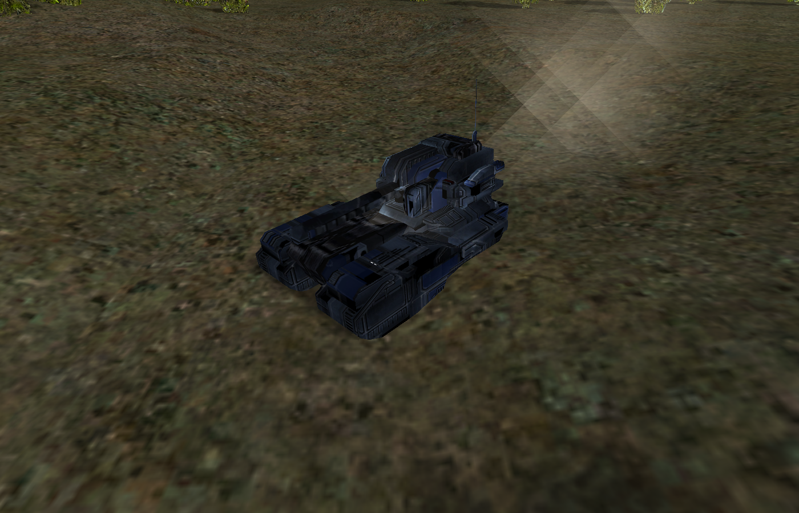

<!-- Generated and maintained by Claude -->
# PLAN.md — the road to a playable Supreme Commander skirmish

[`README.md`](README.md) is the log of what has been built, milestone by
milestone. This file is the direction: what "a simple Supreme Commander game"
means here, what it needs, and what it deliberately does not.

Milestones 1–15 are done and documented in the README. This plan covers **16–20**.

**Target, stated once so it can be checked:** two armies on a retail `.scmap`,
each with an ACU, extracting mass, building from a factory, fighting with
weapons read from the shipped blueprints, and a match that *ends* — last ACU
standing. Playable on `SCMP_009` from the same binary that renders it today.

---

## The decision that shapes everything

Supreme Commander's gameplay is largely Lua: 228k lines across 1414 files, of
which a minimal skirmish would need ~38k (the sim, 568 unit scripts, 288
projectile scripts). Reusing it looks like the cheap road. It is not, and the
measurement is what says so.

That Lua is not a library to call. It is a **client of an API this engine would
have to provide first** — 315 distinct functions the sim subset calls that are
defined nowhere in those 228k lines, across 6734 call sites, plus 193 `On*`
callbacks the engine must fire back. `Unit.lua` alone — the class every unit
is — touches 127 of them, 30 in value-returning position.

And those 315 functions *are* the behaviour. Motion (1174 call sites), damage,
targeting, economy — all C++ in the original; the Lua orchestrates and
decorates. Hosting it means writing the same simulation **plus** a binding
layer **plus** a Lua 5.0 fork (the corpus uses `#` line comments in 1240 of
1414 files, and `table.getn`/`math.mod`/`arg[]`, all removed after 5.0) **plus**
a VFS with archive priority (`lua.scd` overrides `mohodata.scd`'s Unit.lua,
117 lines → 3715). And the sim's semantics would then have to match an
undocumented, closed-source API exactly, with failures surfacing thousands of
lines into someone else's script.

**Two arguments against hosting it turned out to be wrong, and are recorded here
so they are not made again.**

*It is not slow.* Measured on this machine, 1000 units at 10 Hz: the whole tick
in native C costs 5.5 µs; Moho's shape — native motion, Lua woken per unit per
tick making a handful of engine calls — costs 127 µs, of which 121 µs is the Lua.
That is **0.12% of a 100 ms tick budget**, about a sixth of what the renderer
spends *drawing* 800 animated units. The only way to make Lua expensive is to put
per-unit-per-tick arithmetic in it (6× native when measured), and Moho's API
shape structurally prevents that, because the 315 functions are the hot paths.
The real exposure is Lua 5.0's stop-the-world GC over thousands of unit tables —
an argument for 5.1 plus a compat shim, not against Lua.

*It is not all-or-nothing.* Lua is late-bound: a missing engine function errors
only on the line that calls it. So a host can be brought up incrementally — run
the scenario, hit `attempt to call a nil value`, implement that one function,
repeat. An earlier draft of this plan claimed the opposite and it was the
strongest argument it had.

**Decision: reimplement the semantics in C++ first, and treat a Lua host as the
destination rather than an alternative.** The near-term reason is time to a
playable skirmish: road A is the same simulation plus a binding layer plus a Lua
fork plus a VFS, against a closed-source API with no reference to diff. The
long-term reason to keep going is that **modding is how people change this
game**, and no C++ sim accepts a Supreme Commander mod at any price.

So the repo's existing rule still applies — *formats convert, behaviour gets
reimplemented* (ADR-004, ADR-005) — and the Lua is read as a **specification**,
the way `terrain.fx` and `water2.fx` were read for the ground and the sea:
`defaultweapons.lua` (837 lines) states the firing state machine, `Unit.lua` the
damage and build model, the blueprints the constants. Cited `file:line`, same as
the shaders. But the native sim is shaped so the host can arrive later — see the
next section, which is the part of this plan most easily lost.

Full numbers behind this section: `docs/recoil-metal/supcom-lua-gameplay-survey.md`
in the knowledge base.

---

## Designing for a Lua host that does not exist yet

Commenting alone does not buy this. Four decisions are free today and expensive
after milestone 20; everything else about a host can wait.

1. **The sim ticks at 10 Hz, matching Supreme Commander, not the current 30.**
   Its scripts hardcode the rate: `WaitSeconds(n)` is `WaitTicks(n * 10)`
   (`mohodata/lua/simInit.lua:37`). A 30 Hz sim runs every hosted script's
   timing 3× fast, and the fix after the fact is not the tick constant but every
   tuned value that grew up around it. This engine has no lockstep requirement
   forcing 10 Hz, and no reason to refuse it either — render stays decoupled at
   display rate, as it is now.

   **Done in milestone 16**, and it proved its own case twice. Two facts were
   sharing one number: BAR's `turnrate` is per *Recoil* frame, so the loader was
   using the sim's rate to get Recoil's 30, and changing the tick alone would have
   slowed every BAR unit's turning threefold in silence. And one tuned value had to
   follow the rate — the arrival radius, a flat 4 elmos, which at 10 Hz is less
   than one tick of travel, so a unit stepped past its goal every tick and never
   landed inside it.

2. **Native functions carry moho's names, semantics, and units.** `GetBlueprint`,
   `GetPosition`, `SetSpeed`, `SetAccel`, `SetGoal`, `GetHealth`, `AdjustHealth`,
   `DamageArea`, `CreateProjectile`, `SetConsumptionPerSecondMass`. Where the
   original takes ogrids or degrees, the C++ entry point does too and converts
   inward. That turns the eventual binding layer into a mechanical shim instead
   of a translation, and it costs exactly one naming decision per function.
   Where our semantics deliberately differ, say so at the definition.

3. **Events are a documented set, dispatched by name.** The sim fires
   `onCreate`, `onStopBeingBuilt`, `onKilled`, `onDamage`, `onStartBuild`,
   `onStopBuild`, `onGotTarget`, `onLostTarget`, `onImpact`, `onLayerChange` —
   the subset of the original's 193 that these milestones actually reach — as a
   listed, tested set rather than as calls scattered through the sim. A host
   subscribes to the same list.

4. **Content loads through a VFS with archive priority.** `.scd` files are ZIPs
   and miniz is already vendored. This is not Lua-specific work: **blueprint
   mods are the majority of real mods** and they work by layering an archive over
   the stock one, so a VFS earns its keep in the pure-C++ engine too. Extracting
   with a Python one-liner (`tests/test_real_scm.cpp:8`) is fine for fixtures and
   wrong for the app. **Still open**, and milestone 16 found the first thing that
   needs it: 25 unit blueprints name their mesh with a VFS path, and only 21 of
   them resolve against an extracted tree.

**What this does *not* buy, stated plainly so nobody is surprised later:** the
hard part of hosting the game's Lua is semantic fidelity across ~200 functions,
and no amount of preparation today makes that free. These four decisions make
the shim mechanical and the timing correct. They do not make the fidelity job
smaller.

**One fork worth deciding before milestone 21, not now.** "Moddable" and
"runs existing Supreme Commander mods" are different products. Exposing *our own*
Lua 5.4 API — our names, no fork, no compat shim, no 200-function debt — gets
scriptable gameplay cheaply, and gets none of FAF's existing content. Hosting
moho's API gets the ecosystem and owes the fidelity. Decisions 1–4 above serve
both, which is why they can be taken now.

---

## Non-goals

Stated up front, because a skirmish is only reachable if most of the game is
out of scope.

- **Not 568 units.** Six to eight, hand-picked: ACU, engineer, land factory,
  mass extractor, power generator, T1 tank, T1 bot, point defence.
- **No shields, stealth, radar jamming, nukes, transports, experimentals,
  veterancy, adjacency bonuses, or tech tiers.**
- **No fog of war or intel.** Everything is visible. Intel is 16 symbols and
  165 call sites in the original and is its own milestone if ever wanted.
- **No game AI.** The opponent in milestone 20 is a scripted build order, and
  the plan says so in the code. Supreme Commander's own AI is 84,750 lines of
  Lua and is not being reimplemented.
- **No lockstep or multiplayer.** Single machine, so bit-exact determinism is
  not required — though the fixed tick keeps replays reproducible, which
  `--march` already relies on.
- **No campaign, objectives, cinematics, or the game's UI.** The HUD is ours
  and minimal.

---

## Milestones

### 16. Supreme Commander units read their own definitions

**Mostly done.** `--units UEL0201_unit.bp 40 --march 4096 4096 30` puts UEF
medium tanks on `SCMP_009` at 27 elmos/s, 1.57 rad/s and a 3.6-elmo radius, all
read from the file, and 26 of 40 route to the map centre with dust behind them.

What the work actually turned out to be, since half the plan above was wrong:

- **`UnitBlueprint` needed no allow-list entry.** The reader scans to the first
  table literal, so a top-level wrapper's name is never looked at — the same
  source under any other name parses too. The allow-list governs calls in *value*
  position, and `UnitBlueprint` appears once per file, never nested. A test says
  so now, because the next person will assume otherwise.
- **`#` had to become a mid-line comment.** One blueprint in 568 writes
  `NukeCharge = Sound { # added for sound bug`. Widened by measurement: 209
  mid-line `#` comments across all 4065 shipped `.bp` files against **zero** uses
  as Lua's length operator. It stays refused directly after `=`, where it would be
  that operator and swallowing the line would drop the *next* field.
- **`SizeX`/`SizeZ` are at the file's ROOT, not under `Footprint`** — 568/568
  against 363, and `UniformScale` is under `Display`. The two are different
  quantities: a collision box in fractional ogrids, and a whole-square build
  footprint that only the structures state.
- **The collision radius had to become a stored float.** 418 of 568 sizes are
  fractional and 154 are under one ogrid, the smallest 0.01 — as whole squares
  that unit's radius would inflate from 0.04 elmos to 4.
- **The model was 14× too big, and had been since milestone 7.** `.scm` vertices
  are not in ogrids: raw extents run 10 to 262 units, which as ogrids would make
  one experimental 2096 elmos long. `Display.UniformScale` is the missing factor,
  exactly as for props, and it is stored as ONE combined `meshToElmos` because the
  two-step version has already been got wrong once here.
- **Passability comes from the motion class**, as predicted, and the numbers were
  already in the engine: `kDefaultMaxSlopeDegrees` of 17 is 25.5 real degrees, a
  gradient of 0.48, which is what BAR's ground units authorise too. The only slope
  figure the format carries is `Footprint.MaxSlope` — a gradient, not an angle, on
  aircraft landing sites. Water and SurfacingSub are **refused** rather than
  approximated: they need the inverse of the grid, and a ship routed over the
  ground grid drives across dry land.
- **A ground mover's zero depth is not a missing value.** The fallback read 0 as
  unstated and substituted BAR's 12 elmos, which would walk SupCom's land units
  into the sea. It asks the motion class now.
- **The corpus test earned its keep three times**: 38 units have no mesh beside
  them (25 name one with `MeshName`), a further "16 name another unit's id" is a
  regex artefact of `PlaceholderMeshName`, and two blueprints state a scale of
  zero. All three are in the code as comments.

The tick moved to **10 Hz** with it (decision 1), which exposed two facts sharing
one number — BAR's `turnrate` is per *Recoil* frame and wants 30, not our rate —
and one tuned value that had to follow the rate, the arrival radius.

Still open, and carried into 17:

- **A VFS with archive priority** (decision 4). Extraction is still a documented
  Python one-liner, which is right for fixtures and wrong for the app. The 25
  `MeshName` blueprints need a root, and only 21 resolve without one.
- **LOD switching.** Only level 0 is resolved; 563 blueprints declare cutoffs and
  `meshBeside` already takes a level, so this is wiring rather than research.
- **The MotionType ADR**, once a second reader needs the mapping.

### 17. Armies, and units that belong to one — **✔ done**

Nothing in the engine currently knows who owns a unit; team colour is indexed
by batch (`core/scene/TeamColours.hpp`).

- An `Army`: index, faction, colour, alliance. Ownership on every instance.
- Spawn from the map's own `ARMY_<n>` markers, which `scenario::loadStartPositions`
  already reads, and give each army its faction ACU.
- Read the rest of the marker table while there: 3508 `Mass` markers and the
  hydrocarbon sites are what milestone 19 needs, and the shipped nav graph
  (1974 Land / 2120 Amphibious / 1731 Air path nodes) is a free reference to
  check A* against. Note the stock maps place **no units** — all 61 army
  `Units` groups are empty — so spawning is the engine's job, not the map's.
- Selection restricted to your own army; colour taken from the army.

**Done when:** two ACUs face each other on `SCMP_009` in their armies' colours,
and clicking an enemy selects nothing.

### 18. Weapons, projectiles, and damage — **✔ done**

The first milestone where units can lose something.

- Read the `Weapon` table per blueprint: `RateOfFire`, `Damage`,
  `DamageRadius`, `MaxRadius`, `MuzzleVelocity`, `ProjectileId`, the turret
  bones. Spec to read alongside it: `mohodata/lua/sim/defaultweapons.lua` for
  the firing state machine and `lua/sim/Unit.lua` for the damage model.
- Target acquisition: nearest enemy within `MaxRadius`. The separation pass
  already sweeps neighbours per tick (`Movement.hpp:120`) — the same broadphase
  serves both.
- Projectiles: direct and ballistic, flight on the fixed tick, impact,
  `DamageArea` semantics with falloff. Health, death, and a wreck left behind.
- Turrets aim through the existing bone path, so a tank's barrel tracks what it
  shoots rather than the hull turning to face it.
- TDD applies in full: rate-of-fire timing, damage falloff at radius, the
  ballistic solution, and target selection are all pure.

**Done when:** two groups of tanks meet on a `.scmap`, fight, and one group is
left standing with wrecks between them.

**What it came to.** 414 shots over 120 seconds sends eight commanders to mutual
destruction on SCMP_009, and the fight unfolds tick by tick rather than resolving at once.
Three corrections the tests forced, each in the code: reloads were 10% slow (the counter
was checked before being decremented), a flat shot detonated at the muzzle (a unit's
position is at its FEET, so a level shot began at ground height), and with only a
ground-height test every weapon then flew over its target and missed. Emergent and
honest: nothing leads a target, so distant moving units are hard to hit and close ones are
not. Still absent — wreckage, a death explosion (99 of the 494 weapons ARE one, read and
never fired), and turret aiming, which is why firing is not gated on facing.

### 19. Economy and building — **✔ done**

- Mass and energy income, storage and drain per army; the map's `Mass` markers
  become extractor sites.
- Build costs from the blueprints (`BuildCostMass`, `BuildCostEnergy`,
  `BuildTime`) against a builder's `BuildRate`; consumption gated on income, so
  a stalled economy slows construction rather than cheating.
- The ACU and an engineer build structures; a land factory builds units and
  rolls them off (`IssueMoveOffFactory` is what the original does).
- Build progress shown simply — the game's build scaffold and drop-in animation
  are cosmetic and explicitly deferred.

**Done when:** the ACU builds an extractor and a factory, and the factory
produces tanks paid for out of a running economy.

### 20. A skirmish that ends

- A scripted opponent: a fixed build order plus attack-move. Not an AI, and
  labelled as such in the source.
- Win condition: ACU destroyed → army defeated → last army standing wins.
- A minimal HUD — mass and energy, unit count, and a victory banner. Ours, not
  the game's.

**Done when:** a match on `SCMP_009` can be played from spawn to victory, and
`--screenshot` can prove each stage of it.

---

## Cross-cutting

- **Tick.** The sim runs a fixed tick with a clock that clamps catch-up
  (`core/sim/Movement.hpp:27`, `:192`), currently 30 Hz. Milestone 16 moves it to
  **10 Hz** for the reason in decision 1 above, and because it is the last moment
  that change is free — every constant tuned after this point would have to move
  with it. Blueprint rates are authored per second, so the conversion is explicit
  and testable either way; the render loop is unaffected, being decoupled from the
  tick already.
- **Tests.** AGENT.md rule 4 stands: anything that does not touch the GPU gets a
  failing test first, and parsers are tested against the real retail corpus —
  568 blueprints is a corpus, so blueprint reading gets the same treatment the
  1148 models and 60 maps got.
- **Constants.** Every number comes from a blueprint field or a cited line of
  the game's own Lua. No balance invented silently; where something must be
  chosen (the MotionType mapping, the scripted opponent's build order), it is
  named as ours and given a reason.
- **The seam.** Sim state stays plain structs behind narrow free functions, as
  `Movement.hpp` already does. No Lua host is built in milestones 16–20; the four
  decisions above are what keep one buildable in 21+.
