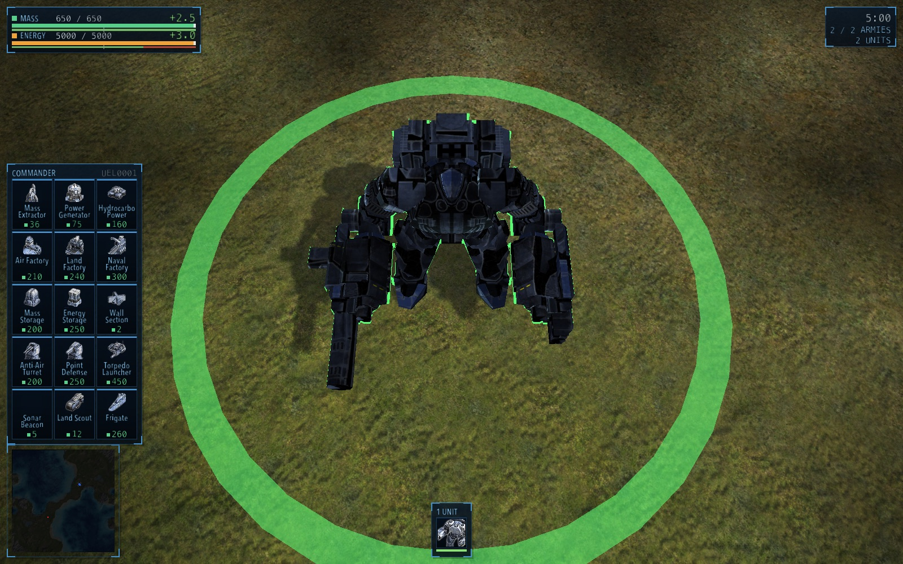
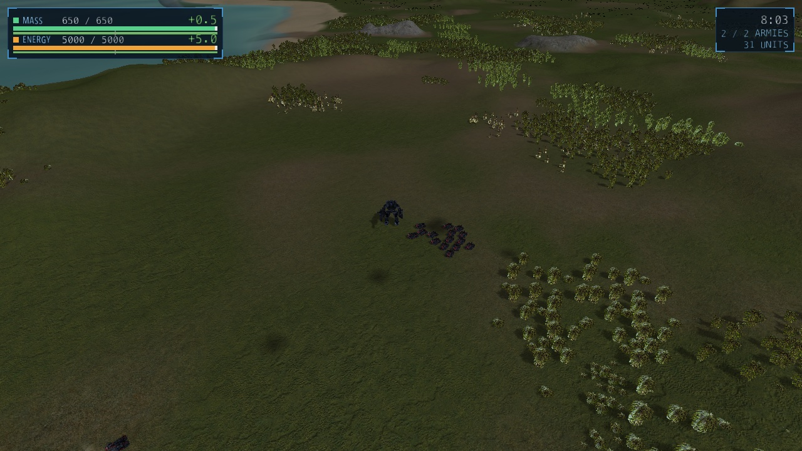
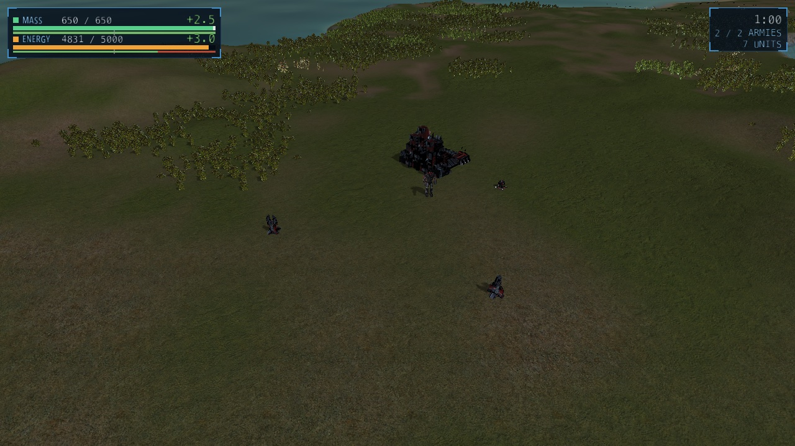
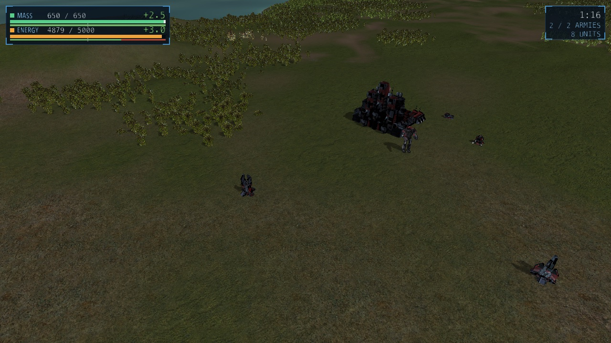
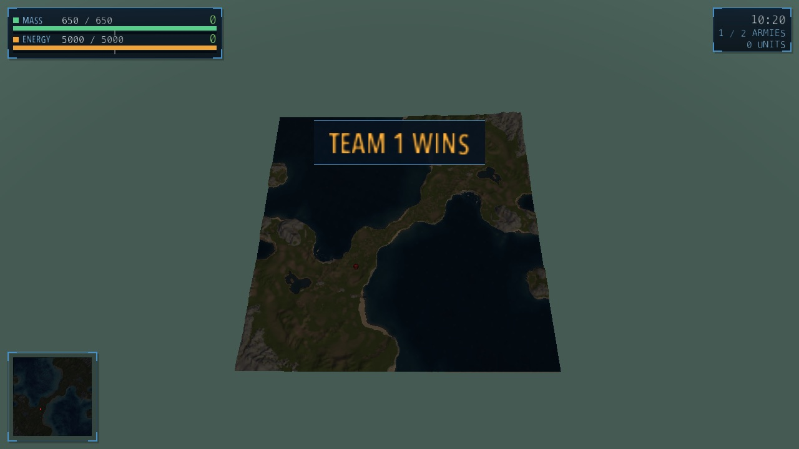
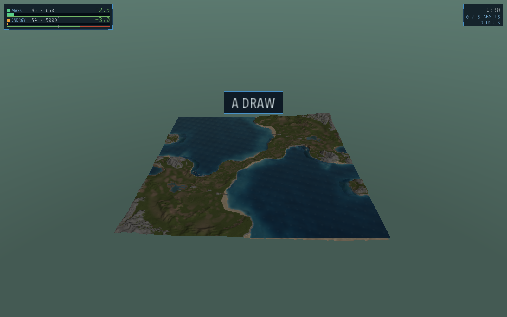

<!-- Generated and maintained by Claude -->
# recoil-metal

A Mac-native RTS engine that reads **Recoil** and **Supreme Commander** content
straight off disk — their maps, models, textures, unit blueprints and sound
banks — and plays a match out of them. It draws through Metal directly instead
of translating OpenGL, and its simulation is fixed-point, so the same command
log replays the same match tick for tick.

It is not a port. Recoil's engine is ~385k lines and reaching a Mac GPU costs it
four translation layers; this is a new C++23 core built test-first through
vertical slices of the two games' data formats. **Formats convert, behaviour
gets reimplemented.**

- **Fast.** 0.554 ms/frame against 7.416 ms for Recoil's OpenGL path on the same
  map and machine — 13.4×. The scope limits are stated rather than glossed:
  it is a full engine frame against a terrain draw, not identical work through
  two APIs ([`docs/benchmark-m4.md`](docs/benchmark-m4.md)).
- **Deterministic.** The sim is fixed point, proved identical at every
  optimisation level by a test. `--hash-log` writes a per-tick state hash and
  `--check-hash-log` names the tick a divergence began at.
- **Tested.** **1129 tests across 103 files, all green.** Anything that does not
  touch the GPU gets a failing test first, and parsers are tested against the
  real retail corpus — all 2034 BAR `.s3o` models and 2552 `.dds` textures.
- **It plays.** Economy, construction, weapons, shields, aircraft, fog of war,
  radar, sonar, reclaim, overcharge, adjacency, sound and an interface —
  a skirmish that ends in a victory banner.
- **Both content families.** Recoil `.smf`/`.smt` maps with `.s3o` models, and
  Supreme Commander `.scmap` maps with `.scm` models, in one scene if you like.
  The loader is picked by the file's own magic bytes.
- **Foreign AI, unmodified.** Forged Alliance's own Lua builder data and
  condition functions choose the opponent's opening through a native placement
  adapter. The corpus is vendored at a pinned commit and **never patched**: 254
  engine names are bound and 107 of 255 vendored files ran in the latest
  650-second headless sanity match. Its manager stack is not hosted yet.
- **No Xcode, no assets.** Apple clang from the Command Line Tools is enough;
  shaders compile from source at runtime. Two small vendored dependencies, both
  fetched. No game content is committed, ever.

```sh
FA="/path/to/Supreme Commander Forged Alliance"

# A whole skirmish on a retail map — spawn to victory banner, headless,
# and identical on every run.
./build/recoil-metal "$FA/maps/SCMP_009/SCMP_009.scmap" --gamedata "$FA/gamedata" \
    --skirmish --armies 2 --play 620 --screenshot /tmp/victory.png 1280 720
# 6s first extractor, 19s power, 55s land factory, 68s first tank off the line,
# 432s the attack column, 590s the fight at your commander's feet, 594s the banner.
```

Without any game content at all, `./build/recoil-metal` still opens on
procedurally generated terrain.

**Where it stands.** Twenty milestones are done and the twentieth ends in that
banner. Since then the window learned to fight in real time rather than being
handed a finished scene. The long version — every milestone, and everything
after the match — is in [`docs/milestones.md`](docs/milestones.md); the design
decisions and their rejected alternatives are in
[`ADR_DECISIONS.md`](ADR_DECISIONS.md).

**Deliberately still open:** the Lua host arc (a real VM, a coroutine scheduler
on the 10 Hz tick, one unit's `Unit.lua` lifecycle diffed tick by tick against
the native run), lockstep networking and FAF lobby integration, and Linux
through an RHI seam — for which the only present obligation is confinement, and
platform and GPU code already stays inside `src/platform` and `src/render`.

### Forged Alliance gameplay gaps

This is a playable vertical slice, not a claim of Forged Alliance feature
parity. The generic implementations cover ordinary economy, construction,
combat, shields, aircraft, surface ships, intel, reclaim and tech upgrades, but
large parts of the retail roster still lack the behaviour that gives them their
role.

| State | Systems |
|---|---|
| **Partial** | large-army pathing and formations; aircraft flight, bombing, fuel and staging; surface naval combat; shield variants; experimentals; factory controls; repair and guard; wreck semantics; FAF AI |
| **Absent** | submarines and submerged combat; transports and cargo; tactical and strategic missiles, silo ammunition and interception; ACU/SCU enhancements; capture and gifting; unit caps; terrain deformation; alternate victory conditions |

Veterancy and hull regeneration moved out of **Absent** in August 2026. Both follow retail
Forged Alliance exactly, including its per-blueprint kill thresholds and the detail that a
veteran hits no harder — only survives longer. The evidence behind every constant is recorded
as claims `C-024`, `C-028`–`C-031` in [`docs/fa-exe-analysis-plan.md`](docs/fa-exe-analysis-plan.md).

The shortest route to those systems is four shared foundations rather than one
special case per unit: complete movement and target layers, generalized
projectiles with ammunition and interception, generalized builder work, and
persistent production controls with mutable unit capabilities. The detailed
dependency order and milestone history live in [`PLAN.md`](PLAN.md) and
[`docs/milestones.md`](docs/milestones.md).

### The question it exists to answer

This is a personal research project, spun out of work on FAR (Forged Alliance
Reborn). Its original premise was that FAR was *blocked* on macOS: Recoil's
model path needs OpenGL 4.3+ SSBOs and Apple caps OpenGL at 4.1. That turned out
to be wrong, and usefully so — Apple's OpenGL is not the only OpenGL on the
platform, and FAR now renders on this Mac through **SDL3 → Mesa EGL → Zink →
kosmickrisp → Metal**. The 4.1 cap is irrelevant.

Which makes the question sharper rather than moot:

> Recoil reaches the GPU on Apple Silicon through four translation layers. What
> does that cost, and what does a purpose-built Metal renderer buy back — and
> what does a modern C++ engine core look like when built test-first, without
> 20 years of legacy coupling?

It also makes the answer *measurable*: there is a working OpenGL baseline to
benchmark against on the same machine, which the project previously did not have.

---

## Contents

- [What it looks like](#what-it-looks-like)
- [Build](#build) — dependencies, compile, test
- [Run](#run) — a map, units, a match
- [Controls](#controls)
- [The interface](#the-interface)
- [Quality settings](#quality-settings)
- [What else it draws](#what-else-it-draws) — Supreme Commander content, props, animation, fog
- [Every flag](#every-flag)
- [Getting content](#getting-content) — maps and assets, none of them committed
- [Why not port Recoil class-by-class](#why-not-port-recoil-class-by-class)
- [Layout](#layout)
- [Legal](#legal)

---

## What it looks like

Every image below is this renderer's own output, written by `--screenshot`.
Both content families throughout: Recoil/BAR maps and models, and Supreme
Commander `.scmap` maps with `.scm` models.

|  |  |
|---|---|
|  |  |
| **The interface** — the build tray draws the archives' own 64×64 icons, names and mass costs; the minimap is the `.scmap`'s own embedded preview | **A match that ends** — a scripted opponent builds a base, streams tanks, and comes for your commander |
|  |  |
| **Sky and water**, ported from the games' own `sky.fx` and `water2.fx` | The same code on a `.scmap` — the horizon colour is the map's, not ours |
|  |  |
| **The Supreme Commander ground splat** — nine tiled strata assembled per frame from a recipe, since a `.scmap` bakes no ground texture at all | Seton's Clutch, whole-map |
|  |  |
| **Shadow mapping** from a camera-following light box | **800 instanced units**, each on its own animation phase |
|  |  |
| **Click-to-move**, five seconds after the order | The same order once **A\* pathfinding** landed — units route round what they cannot climb |
|  |  |
| **Refraction and planar reflection** — the sea absorbs by Beer-Lambert, so a shallow sandy bottom stays sandy | A **4096-square** map, decimated to fit rather than refused |
|  |  |
| **Selection rings** that follow the ground rather than hovering flat over it | **Per-stratum normal maps**, at the scale an 8-elmo height sample cannot reach |
|  |  |
| **The scenery a map places** — 5182 props here, and 46 971 on the busiest stock map | **Dust**, aged entirely in the vertex shader |

More in the [milestone notes](docs/milestones.md): [`m5-units-close`](docs/images/m5-units-close.jpg),
[`m5-units-wide`](docs/images/m5-units-wide.jpg),
[`m8-rally-50s`](docs/images/m8-rally-50s.jpg),
[`m10-water`](docs/images/m10-water.jpg),
[`m10-water-fa`](docs/images/m10-water-fa.jpg),
[`m12-map-sky-coast`](docs/images/m12-map-sky-coast.jpg),
[`m12-map-sky-desert`](docs/images/m12-map-sky-desert.jpg).

---

## Build

**Requires** macOS 14+, Apple clang from the Command Line Tools (`xcode-select
--install` — no Xcode), and CMake + Ninja.

```sh
brew install cmake ninja
git clone <this repo> recoil-metal && cd recoil-metal
```

Two dependencies are vendored into `third_party/` and neither is committed.
CMake fails with these exact commands if either is missing:

```sh
# Apple's official C++ bindings for Metal
git clone --depth 1 https://github.com/apple/metal-cpp third_party/metal-cpp

# miniz, a single-file MIT ZIP reader — Recoil ships content in .sdz archives,
# which are ZIPs
mkdir -p third_party/miniz && curl -L \
  https://github.com/richgel999/miniz/releases/download/3.0.2/miniz-3.0.2.zip \
  | tar -xf - -C third_party/miniz
```

Then build and test. Catch2 is fetched by CMake at configure time:

```sh
make build
make test
#   100% tests passed, 0 tests failed out of 1129
```

Or without the Makefile:

```sh
mise exec -- cmake -B build -G Ninja -DCMAKE_BUILD_TYPE=RelWithDebInfo
mise exec -- cmake --build build
mise exec -- ctest --test-dir build --output-on-failure
```

A handful of tests skip rather than fail when no game content is present — see
[Getting content](#getting-content).

---

## Run

`make help` lists every target with the content paths it resolved. The short
version:

```sh
make run      # procedural terrain — no game content needed at all
make play     # a duel you drive: army 0 is yours, army 1 is scripted
make watch    # every side scripted, nothing selectable, no fog
make verify   # replay the golden match — prints "determinism: MATCH"
```

Anything is overridable: `make play ARMIES=8 ALLIANCES=2 FACTIONS=uef,seraphim`.
Add `FAF=1` to `play` or `watch` when Forged Alliance's AI should drive the
opponents instead of the deterministic native script.
Content roots come from `local.mk` first, then the environment
(`RM_FA_ROOT`, `RM_BAR_ROOT`, `RM_BAR_MAPS`).

The binary underneath takes a map and a pile of flags:

```sh
./build/recoil-metal                    # procedural terrain, no assets needed
./build/recoil-metal path/to/map.smf    # a real Recoil map
```

### Benchmarks

`--bench` is windowed and vsync-limited — use it to eyeball GPU ms.
`--bench-offscreen` is headless and unthrottled, and **is the comparable
number**.

```sh
./build/recoil-metal path/to/map.smf --bench 600 docs/bench.csv
./build/recoil-metal path/to/map.smf --bench-offscreen 2060 docs/bench.csv

# The Recoil OpenGL baseline for the same map (needs FAR's zink build)
tools/bench_recoil_gl.sh docs/bench-recoil-gl.csv
```

The benchmark states which [quality switches](#quality-settings) were on, since
otherwise two of its own numbers are not comparable.

### Units on a map

```sh
BAR=~/projects/llm/games/faf/forged-alliance-reborn/reference/BAR/objects3d/Units

# 800 instances: one per map start position, the rest scattered on land
./build/recoil-metal path/to/map.smf --units $BAR/corgantbig.s3o 800

# --focus frames the first instance instead of the whole map, because a unit is
# under 1% of an 8192-elmo map's width and otherwise renders as a few pixels
./build/recoil-metal path/to/map.smf --units $BAR/corgantbig.s3o 40 --focus

# repeat --units for more models; textures shared between them upload once
./build/recoil-metal path/to/map.smf \
    --units $BAR/corgantbig.s3o 30 --units $BAR/armstump.s3o 60 \
    --units $BAR/corraid.s3o 60 --focus
# scene: 3 models, 4 textures uploaded, 2 texture binds per frame
```

### Moving units

Left-click selects the unit under the cursor (a ring appears under it);
right-click orders it to the ground under the cursor and marks the spot — a
crossed amber ring that shrinks toward the point and fades over a second and a
half. A cross rather than another ring, because the two appear on the same ground
within a second of each other and colour alone is one distinction too few. Drags still belong to the
camera — only a press and release that stayed put counts as a click.

```sh
# --march <x> <z> <seconds>: order EVERY unit to a point and pre-run the sim.
# Click-to-move cannot be screenshotted, so this is the reproducible way in:
# the same orders and the same tick count give the same scene every run.
./build/recoil-metal "$MAP" --units $BAR/armstump.s3o 200 --march 1500 1500 0 --focus

# ...and the same scene frozen 14 seconds later, headless
./build/recoil-metal "$MAP" --units $BAR/armstump.s3o 40 \
    --march 2000 2000 14 --focus --screenshot /tmp/marched.png 1200 800
```

`--units <model.s3o> [count] [scale]`, repeatable. Textures are resolved by the
name the `.s3o` carries, under BAR's `unittextures/`; models naming the same
file share one upload, and the draws are ordered so each texture *pair* is bound
once per frame rather than once per model — which is the unit Recoil batches on
too. The first `--units` takes the map's start positions; the rest are scattered.

### A match (milestone 20)

```sh
FA="/path/to/Supreme Commander Forged Alliance"

# The whole skirmish, spawn to victory banner, deterministic: a scripted
# opponent (a fixed build order plus one attack wave — core/sim/BuildOrder.hpp,
# not an AI) builds a base, streams tanks, and comes for your commander.
./build/recoil-metal "$FA/maps/SCMP_009/SCMP_009.scmap" --gamedata "$FA/gamedata" \
    --skirmish --armies 2 --play 620 \
    --screenshot /tmp/victory.png 1280 720

# The same match at any earlier moment is a screenshot of that stage:
#   6s the first extractor, 19s power, 55s the land factory, 68s the first tank
#   off the line, 432s the attack column, 590s the fight at your commander's
#   feet, 594s the banner.
# --focus frames the first instance — the player's commander, which is exactly
# where the wave arrives; --look aims at a world point instead (X Z RADIUS).
./build/recoil-metal "$FA/maps/SCMP_009/SCMP_009.scmap" --gamedata "$FA/gamedata" \
    --skirmish --armies 2 --play 590 --focus \
    --screenshot /tmp/the-fight.png 1280 720
```

The stage times above are what the match does *now*, and they have moved once:
the attack wave used to be a hardcoded 20 tanks going in at 335s, and now that it
sizes itself from the unit it is made of it is 29 tanks at 432s, with the banner
at 594.2s rather than 502.2s. `make verify` is the guard that the movement was
intended — it replays 7000 ticks against `docs/golden-p1.log` and prints
`determinism: MATCH`.

`--play <seconds>` is `--march` without the blanket move order — the sim runs
and the scripted armies decide their own movement. `--armies N` takes the first
N of the map's start positions (SCMP_009 declares eight; a duel wants two). The
player is army 0 and the script drives everyone else.

| | |
|---|---|
|  |  |
| **1:00** — the opponent's base: extractor, power, factory | **1:08** — the first tank rolls off the pad |
|  |  |
| **9:50** — the wave arrives at the player's commander, health bars over the damaged | **9:54** — a match that *ends* |

### Finding content

`--data-dir <dir>` adds a directory to the asset search path, and `--archive
<file.sdz>` extracts a Recoil archive to a temporary directory and searches
that. Both are repeatable and searched in the order given. Model and texture
lookups fall back to the historical hard-coded BAR layout, so existing command
lines keep working.

```sh
# A unit definition names its own model, found through the search path
./build/recoil-metal "$MAP" --data-dir ~/games/bar \
    --units ~/games/bar/units/ArmBots/armpw.lua 40
```

---

## Controls

RTS conventions, because the camera was a model viewer's before this and a view that
swings when you meant to select is the most disorienting thing an RTS camera can do.

| input | does |
|---|---|
| `W` `A` `S` `D` | pan the map. Speed is scaled by the frustum's width at the target, so it feels the same zoomed in as out — one and a half seconds to cross the visible width |
| left click | select one of YOUR units. Shift/cmd/ctrl adds to the set |
| left drag | band-select everything of yours inside the rectangle |
| double click | widen to the TYPE — every unit like it that projects into the viewport. On screen rather than map-wide, because both reference games do that, and "everything like this, everywhere" silently commits units you cannot see |
| right click | order: move to the ground, attack the enemy under the cursor, **assist** your own builder (lend it your build rate), or **reclaim** the wreck |
| cmd + right click | overcharge: fire the commander's manual weapon at the target once the energy bar has filled |
| `shift+A`, then right click | attack-move: engage visible enemies on the route, then resume the destination |
| `P`, then right click | patrol between the unit's starting point and the destination; repeat `P`, then shift-right-click to add a waypoint |
| shift + any order | queue it behind the ones already given, drawn in the world as you go |
| `ctrl`+`0`–`9` / `0`–`9` | set a control group / recall it, the dead pruned out on recall |
| click a tray cell, then the ground | build: the ghost is cyan where the footprint fits and red where it does not. Right-click or a second cell click cancels |
| hold `space` + drag | swing the camera. Let go and it returns to the overhead view the app opened with, so a glance never costs you your bearings |
| shift + drag | pan with the mouse |
| scroll | zoom |

The map is framed whole on load (`OrbitCamera::frame`), so the opening view is the
whole map rather than a corner of it.

Panning drags the ground under the cursor rather than moving by a tuned
constant — the step comes from the frustum's width at the camera's target, so it
keeps pace with the pointer at any zoom. The target is held inside the map, since
at a whole-map framing one point of mouse travel is ~18 elmos and a single
ordinary drag would otherwise leave the map with nothing to navigate back by.

---

## The interface



A resource panel is an **instrument, not a scoreboard**. What a player of this game watches is
not how much mass they have but which way it is going and whether their build is funded — the
economy is a flow and a stall slows everything by one shared fraction — so the panel shows
rate and throttle first and totals second.

    ▪ MASS     120 / 650     +2.5
      ████░░░░░░░░░░░░░░░░░░░░░░
       ▓▓▓▓▓▓▓▓▓▓▓|▓▓▓▓▓▓▓▓▓▓▓▓          <- the flow strip
    ▪ ENERGY   144 / 5000    +3.0
      █░░░░░░░░░░░░░░░░░░░░░░░░░
       ▓▓▓▓▓▓▓▓▓▓▓|▓▓▓▓▒▒▒▒▒▒▒▒
    BUILDING AT 8% ▬▬▬░░░░░░░░░░         <- only while there is a stall

**The flow strip** is the one thing here worth remembering. Income grows from the left in
green and drain from the right in red, meeting at a notch. *Where they meet* is the reading:
past the notch you are earning, short of it you are spending down, and no number has to be
read for it. Two states ride on the same bar — a lit cap when the store is full and income is
being thrown away, and a throttle line when construction is not fully funded — both of them
real mechanics rather than decoration.

**Two typefaces, deliberately paired.** Avenir Next Condensed for labels, which are read once
and should look engraved; Menlo for readouts, because its figures are tabular and in a
proportional face a live mass figure jitters sideways as its digits change width. An engraved
label against a mechanical counter.

**The chrome wears the player's faction and the resources never do.** Mass is green and energy
amber in every livery, because those are identities a player has learned. Three of the four
faction colours collide with a reserved one — Aeon's green with mass, Cybran's red with a loss,
Seraphim's gold with energy — and the collision is resolved by moving the *livery*, since a
resource's colour is an identity and a faction's is a coat of paint. A test asserts the
distance, and it caught the first two attempts being too close to tell apart.

Panels are glass with a lit top edge and corner brackets rather than full borders: brackets say
where a panel's bounds are without the frame competing with the numbers inside it.

---

## Quality settings

Three switches, all on by default, all one keypress away:

| key | flag | default | costs |
|---|---|---|---|
| `r` | `--no-reflections` | on | +0.50 ms |
| `n` | `--no-stratum-normals` | on | +0.21 ms |
| `o` | `--no-props` | on | +0.17 ms at a working zoom, nothing zoomed out |
| `f` | `--refraction` | **off** | +0.17 to +0.28 ms |

Defaults are **looks-best**, deliberately. The cheap-by-default argument is the
usual one and it is wrong here: what is being demonstrated is how the content
looks when a Metal renderer draws it, and a reader who runs this should see what
the screenshots show. What that does oblige is that the benchmark states which
switches were on, since otherwise two of its own numbers are not comparable —
which it now does.

The water's refraction is the one that defaults off, and by the same rule rather
than as an exception to it: with the wave field this water has, it does not look
best. The offset itself works — it needs a copy of the colour target, since a
framebuffer fetch reads one pixel and no other, so the pass splits in two around a
blit — and what it reveals is that the field being bent by is two analytic wave
trains standing in for the engine's four scrolling normal maps. Move a
screen-space sample by a field that regular and it draws the field's own lattice
across the water: rings tens of pixels wide at swell frequency, a diagonal hatch
at ripple frequency, at every strength down to a quarter of the engine's. It is
waiting on the water's normal coming from real textures, which was never the part
that looked hard.

To state a preference rather than pass a flag, write a Lua table to
`~/Library/Application Support/recoil-metal/settings.lua`. It is read by the same
data reader that reads `mapinfo.lua`; a missing file is the ordinary case, and a
key of the wrong type is reported rather than coerced.

```lua
-- a machine that would rather have the frame rate
{
    reflections = false,
    stratum_normals = true,
    props = false,
    refraction = false,
}
```

Flags beat the file: a flag is somebody asking for this run, the file is somebody
stating a preference. There is no `--reflections` to turn one back on, because the
defaults are already on and the only thing a flag has ever needed to say is "not
this time".

---

## What else it draws

Everything below needs game content — see [Getting content](#getting-content).

### Fog of war, radar and sonar

```sh
# Terrain blocks sight, which is Recoil's model and the default: hills hide what
# is behind them and high ground is worth taking.
./build/recoil-metal "$FA/maps/SCMP_009/SCMP_009.scmap" --gamedata "$FA/gamedata" \
    --skirmish --armies 2 --play 300

# Flat discs, which is what Supreme Commander does — `effects/vision.fx` stamps a
# radius at a position and never samples a height, so you see over mountains.
./build/recoil-metal "$FA/maps/SCMP_009/SCMP_009.scmap" --gamedata "$FA/gamedata" \
    --skirmish --armies 2 --play 300 --vision-style fa

# ...and `--observer` draws no fog at all, because watching is seeing everything.
```

Every unit sees as far as its own blueprint says: Forged Alliance's `Intel` block
in ogrids (a Cybran ACU's `VisionRadius = 26` is 208 elmos), BAR's
`sightdistance` in elmos already. 355 of the 568 shipped blueprints see, 57 carry
radar, 67 sonar; the widest radar is 4800 elmos against the widest sight of 800,
which is what says radar is a different order of thing from sight.

What it changes, in order of how much you notice:

- **A unit no longer shoots what its side cannot see.** Until this existed,
  `nearestTarget` picked from the whole unit store filtered by hostility and
  range, so everything in the match engaged targets across the map.
- **Unseen units are not drawn and cannot be clicked.**
- **Radar and sonar give a blip** — a position without an identity, drifting
  within 96 elmos of the truth. The minimap plots them in a colour that is
  nobody's team colour, because whose it is and what it is are the two facts a
  contact withholds.
- **Unseen ground is darkened, not blacked out.** Both source engines keep
  terrain readable: you need the shape of the ground you are about to walk into
  even when you cannot see what is standing on it.

The two engines disagree about what vision *is*, which is why the style is a
setting rather than a decision — see `ADR-037`. The structure underneath is
Recoil's: a reference count per square per alliance, so one unit's sight can be
withdrawn without re-deriving every other unit's. The grid is integer and enters
the state hash, so `--hash-log` and `make verify` cover it with no new machinery.

**Since then, eight of ADR-037's nine landed.** *Omni* sees everything in its
radius, cloaked and stealthed alike — 17 units declare one — and it is a grid of
its own rather than a flag on the vision grid, because it answers a different
question at contact time: vision asks "is this square lit", omni asks "is this
square lit by something nothing can hide from". Merging them would have meant
either stealth defeats omni or stealth defeats nothing. *Cloak* and the two
per-unit stealth flags hide a unit from a named sense; the *stealth fields* (the
B4203 generators, seven units declaring each radius) are a second kind of grid
entirely — "who is HIDDEN here" rather than "who can see here", keyed by the
field owner's alliance rather than the viewer's. *CloakField* has no entry
because it appears zero times in retail content.

Still absent, each for its own stated reason: a water-vision grid (nothing is
submerged yet, so it would have no target to answer about and no test that could
tell it from an empty one), air LOS (it needs a flying/grounded distinction the
coverage query does not yet make), and seismic.

### Supreme Commander models

`.scm` loads into the same `Model` struct `.s3o` does, and the same magic sniff
picks the loader:

```sh
FA=~/projects/llm/input/faf/units
./build/recoil-metal "$MAP" --units $FA/UEL0201/UEL0201_LOD0.scm 40 --focus

# both content families in one scene, one draw each
./build/recoil-metal "$MAP" --units $FA/UEL0201/UEL0201_LOD0.scm 40 \
    --units $BAR/armstump.s3o 40
```

Models are extracted once from the retail install's `units.scd` (a ZIP) into
`~/projects/llm/input/faf/` — see `tests/test_real_scm.cpp` for the command.
Textures are found beside the model by Supreme Commander's naming convention
(`_Albedo`, `_SpecTeam`), since `.scm` names none.

### Supreme Commander maps

Same binary, same arguments — the format is sniffed from the file's magic:

```sh
FA="/Volumes/Samsung_T5/faf/Supreme Commander Forged Alliance/maps"
./build/recoil-metal "$FA/SCMP_009/SCMP_009.scmap"

# BAR units on a Forged Alliance map: both content families in one scene
./build/recoil-metal "$FA/SCMP_009/SCMP_009.scmap" --units $BAR/corgantbig.s3o 250
```

Ground colour comes from the map's terrain-type array rather than a texture:
`.scmap` ships no baked ground, so until the splat shader exists those bands are
the stand-in. No game assets are read from anywhere but the retail install.

### Ground layer textures

The splat's layers are paths into `env.scd`, another ZIP. Only the layer
directories are extracted — 402 files and 135 MiB of the archive's 1.15 GiB of
DDS, of which the stock maps name 184 — so a ZIP reader stays deferred:

```sh
python3 - <<'PY'
import zipfile, os
scd = '/Volumes/Samsung_T5/faf/Supreme Commander Forged Alliance/gamedata/env.scd'
dest = os.path.expanduser('~/projects/llm/input/faf')
z = zipfile.ZipFile(scd)
for n in z.namelist():
    if n.lower().startswith('env/') and '/layers/' in n.lower() and n.lower().endswith('.dds'):
        z.extract(n, dest)
PY
```

Without them the map still draws: the terrain-type colour bands from milestone 6
stay loaded as the fallback, and the splat simply does not switch on.

### Prop meshes

The same archive, and the same deal — a `.scmap`'s props name blueprints
(`/env/Tropical/Props/Trees/Palm02_s1_prop.bp`) whose meshes and textures sit
beside them. 1511 files and 160 MiB, against 335 blueprints the stock maps
between them reference:

```sh
python3 - <<'PY'
import zipfile, os
scd = '/Volumes/Samsung_T5/faf/Supreme Commander Forged Alliance/gamedata/env.scd'
dest = os.path.expanduser('~/projects/llm/input/faf')
z = zipfile.ZipFile(scd)
for n in z.namelist():
    if n.lower().startswith('env/') and '/props/' in n.lower() \
            and n.lower().endswith(('.bp', '.scm', '.dds')):
        z.extract(n, dest)
PY
```

Without them the map draws bare: the prop list is still parsed and counted, and
every blueprint that fails to resolve is reported once.

### Animation

`--animate <file.sca>` attaches an animation to the `--units` before it. The
windowed app advances its own clock; `--time <seconds>` freezes it, which is what
makes a screenshot or a benchmark of an animated scene reproducible.

```sh
./build/recoil-metal "$MAP" \
    --units $FA/DEL0204/DEL0204_lod0.scm 1 \
    --animate $FA/DEL0204/DEL0204_awalk.sca --focus
#   animation DEL0204_awalk: 2.33s, 71 keyframes, 19 of 20 bones driven
```

Every keyframe's pose is computed once at upload and playback is a buffer
offset, so 800 animated units cost 0.70 ms/frame — the same as 800 static ones.
`.s3o` has no equivalent: the format carries no rotation at all, and Recoil
drives unit motion from scripts instead.

### More Recoil maps

The feature question needed a corpus rather than one map. BAR publishes a validated
index of live maps with direct download URLs, which is the only part of this worth
scripting:

```sh
mkdir -p ~/projects/llm/input/recoil/maps/bar && cd ~/projects/llm/input/recoil/maps/bar
curl -s -o /tmp/live_maps.json \
  https://maps-metadata.beyondallreason.dev/latest/live_maps.validated.json
python3 -c "import json;[print(d['downloadURL']) for d in json.load(open('/tmp/live_maps.json'))]" \
  | head -8 | while read -r u; do
      curl -s --max-filesize 45000000 -O "$u"   # most are 25-85 MB
    done
for f in *.sd7; do 7zz e -y "$f" -o"${f%.sd7}" "maps/*.smf" >/dev/null; done
```

What they say is in the [milestone notes](docs/milestones.md): sixteen `TreeTypeN` entries declared and
never used, on every map checked. Only the `.smf` is extracted, because the feature
list is the only thing this corpus was fetched to answer.

---

## Every flag

The walkthrough above uses about half of these. The rest exist for the same
reason `--screenshot` does: **a headless run has no cursor**, and interface that
only appears under one cannot otherwise be captured, tested, or diffed.

| flag | does |
|---|---|
| `--gamedata <dir>` / `--data-dir <dir>` / `--archive <file>` | where content is found: the retail `gamedata` folder, a loose tree, or one `.scd`/`.sdz` mounted by hand |
| `--units <path> <n>` | spawn N of a model or blueprint, scattered deterministically |
| `--factions <a,b,…>` | each seat's side, cycled — mirrors and matchups are one flag |
| `--armies <n>` / `--alliances <n>` | how many of the map's start positions are seated, and how they pair up |
| `--skirmish` | spawn commanders and run the match rules |
| `--observer` | watch without a seat: no fog, no selection, nobody's commander |
| `--march <x> <z> <s>` / `--play <s>` | pre-run the sim: with a blanket move order, or letting each side decide |
| `--tick-rate <hz>` | the sim's rate for this run, 5–50 Hz. Applied *first*, because speeds and reloads derive from it at spawn |
| `--no-interpolate` | draw the newest snapshot rather than blending two. **Every golden image is taken with this** — a screenshot of tick N should *be* tick N, not depend on when the process was scheduled |
| `--focus` / `--look <x> <z> <r>` | aim the capture at the first instance, or at a world point |
| `--select <n>` / `--hover <n>` / `--ghost <x> <z>` | light up interface a headless run has no cursor to produce: N units selected, the Nth tray option hovered with its info card, the placement ghost at a world point |
| `--ui <fa\|bar\|neutral\|faf>` / `--ui-scale <0.5..3>` | select FA, BAR, neutral, or classic FAF presentation (`fa` is the default; the first resource reads Mass, Metal, or Material respectively; `faf` wears the game's own nine-slice chrome); request HUD scaling relative to automatic size. Values clamp; available fit wins, and enlargement uses only room beyond the automatic 2.5× cap |
| `--vision-style <recoil\|fa>` | whether terrain blocks sight |
| `--ai-faf` | FAF's own AI plays every army, through the sandbox |
| `--ai-log` / `--ai-debug` / `--ai-sanity` | narrate the AI's decisions and the corpus's own `LOG` lines; the debug report; the closing census of what was built, which bindings were called, and which corpus functions ran |
| `--hash-log <f>` / `--check-hash-log <f>` | write a per-tick state hash, or replay against one and name the tick a divergence began at |
| `--command-log <f>` / `--replay-commands <f>` | record the orders given, or play them back into the same match |
| `--print-events` | narrate the sim's own event queue |
| `--volume <0–1>` / `--mute` | the mixer |
| `--dump-weapon <id>` | print one blueprint's weapons as the loader read them |
| `--bench <n>` / `--bench-offscreen <n> <csv>` | windowed and vsync-limited, or headless and unthrottled — the second is the comparable number |
| `--screenshot <f> <w> <h>` | render one frame offscreen and exit |
| `--time <s>` / `--animate` | advance the clock before capturing; run model animation |
| `--no-reflections` `--no-stratum-normals` `--no-props` `--refraction` | quality, as in the table above |

---

## Getting content

**No game assets are or will ever be committed.** Tests that need them skip
rather than fail. These are the recipes for providing your own from installs you
own.

### A Recoil map

No game assets are committed, so the real-map tests skip unless one is present.
To provide it:

```sh
mkdir -p ~/projects/llm/input/recoil/maps && cd $_
curl -sLO "https://files-cdn.beyondallreason.dev/file/9fc29b4e9dd666d9f9866280fb3c0861/angel_crossing_1.4.sd7"
7zz e -y angel_crossing_1.4.sd7 maps/aw04.smf maps/aw04.smt mapinfo.lua -o.
```

Extract all three, not just the `.smf`: `mapinfo.lua` carries the authoritative
height range (the binary header's is wrong on this map), and `aw04.smt` is the
ground texture. Without the `.smt` the terrain still renders, shaded by
elevation — which is also what the engine does for a missing tile file.
### Screenshots

`--screenshot` renders one frame offscreen and writes a PNG. No window, so it
works regardless of which Space is active — capturing the app's own window by id
fails outright for a window on an inactive Space, which is why this exists.

```sh
./build/recoil-metal path/to/map.smf --units $BAR/corgantbig.s3o 40 --focus \
    --screenshot docs/images/units.png 2000 1200
```

PNG encoding goes through ImageIO, which is part of the OS — not a dependency.

The renderer always writes PNG. What the README shows is a **downscaled JPEG**
of it (1600 px wide, quality 90), which is a fifth of the bytes for detail that
is invisible at the width GitHub renders an image anyway. Regenerate the whole
set after adding a shot:

```sh
cd docs/images && for f in *.png; do
    sips -Z 1600 -s format jpeg -s formatOptions 90 "$f" --out "${f%.png}.jpg"
done
```

The PNGs stay out of git (`.gitignore`); the JPEGs are what is committed.
---

## Why not port Recoil class-by-class

Measured on the real tree (`reference/RecoilEngine` in FAR, Spring/Recoil
`rts/`): of ~1.95M lines, **1.57M is `rts/lib/`** — vendored third-party code
nobody rewrites. The engine proper is ~385k lines:

| Subsystem | kLOC | Plan |
|---|---|---|
| Sim (units, weapons, pathing) | 83k | later, *semantics* reimplemented — not classes |
| Lua bindings | 74k | never port; reimplement minimal when needed |
| Rendering (OpenGL) | 67k | **replaced — this project** |
| System (SDL, threads, FS) | 65k | take only what's needed |
| Game / ExternalAI / RmlUI / Net / Menu | ~81k | never port |

Two facts make the strategy possible: `rts/Sim` includes **zero** GL headers,
and only 18 sim files touch rendering globals — the sim↔rendering boundary is
real. But a horizontal port (Sim → Lua → Game → System) still means ~250k
lines before one pixel renders. So instead: **vertical slices through data
formats**. Loaders are small and data-shaped; the renderer is new.

The rule, inherited from FAR: *assets/formats convert, behaviour gets
reimplemented.*

---

## Layout

```
recoil-metal/
├── CMakeLists.txt      single build file, sections commented
├── src/
│   ├── core/           pure C++ — no Metal, no AppKit, fully unit-tested
│   │   ├── sim/        the simulation: units, orders, combat, economy,
│   │   │               pathing, intel, reclaim, shields, replay, hashing
│   │   ├── unit/       unit definitions, the build tree, adjacency tables
│   │   ├── blueprint/  Supreme Commander `.bp` reading
│   │   ├── map/        SMF/SMT and `.scmap` loaders, mapinfo.lua, tile atlas
│   │   ├── model/      `.s3o` and `.scm`/`.sca` into one model struct
│   │   ├── scene/      what is drawn, and the batches it is drawn in
│   │   ├── ui/         HUD, minimap, build tray, roster, icon atlas
│   │   ├── audio/      XACT wave banks, mixer, cues
│   │   ├── vfs/        archive mounting and search-path priority
│   │   ├── lua/        Lua table-literal reader (data, not programs)
│   │   ├── data/       the shipped openings and tables
│   │   ├── mesh/       heightfield triangulation
│   │   ├── texture/    DDS decoding and atlas packing
│   │   ├── text/       glyph atlas
│   │   ├── bench/      the benchmark harness
│   │   ├── settings/   quality switches
│   │   └── camera/     orbit camera + projection
│   ├── app/            wiring: CLI, the match loop, the FAF AI adapter
│   ├── render/         Metal renderer (Objective-C++ where bridging)
│   ├── platform/       AppKit window + display link (pImpl hides ObjC)
│   └── main.mm         thin entry point
├── tests/              Catch2 unit tests, mirrors src/core — 103 files, 1129 tests
├── third_party/        metal-cpp and miniz (fetched, gitignored)
├── vendor/ai/          foreign AI corpora at pinned commits (fetched, gitignored,
│                       NEVER modified — `make ai`, ADR-039)
└── docs/               research notes, benchmark results, the golden hash log
```

## Legal

**Licence: GPL-2.0-or-later** — the full text is in [LICENSE](LICENSE).

Recoil states its own terms as "version 2 of the License, or (at your option)
any later version" (`LICENSE` in the engine tree). Loader code here is adapted
from it, so this project takes the same terms rather than a subset: `GPL-2.0`
alone would be *narrower* than upstream and would strip the downstream choice
Recoil deliberately grants.

What is adapted, and therefore what carries the obligation:

| Here | From |
|---|---|
| `.smf` / `.smt` map loaders | `rts/Map/SMF/` |
| `.s3o` model loader and its team-colour convention | `rts/Rendering/Models/`, `ModelFragProgGL4.glsl` |
| The 30 Hz tick, and `GAME_SPEED` with it | `rts/Sim/Misc/GlobalConstants.h` |
| Water plane at `y = 0` | `rts/Map/Ground.h` |
| Model lighting defaults | `rts/Map/MapInfo.cpp` |

Supreme Commander shaders (`terrain.fx`, `mesh.fx`, `water2.fx`, `sky.fx`) are
read as a **specification** and reimplemented in MSL — no HLSL is copied, and
none of it is redistributed here. Reading either engine's source as a spec is
unrestricted; it is the *adapted* Recoil code above that sets the licence.

No game assets are or will ever be committed — same rule as FAR. The
screenshots under `docs/images/` are output of this renderer, not game content,
though they necessarily depict textures the two games ship.
