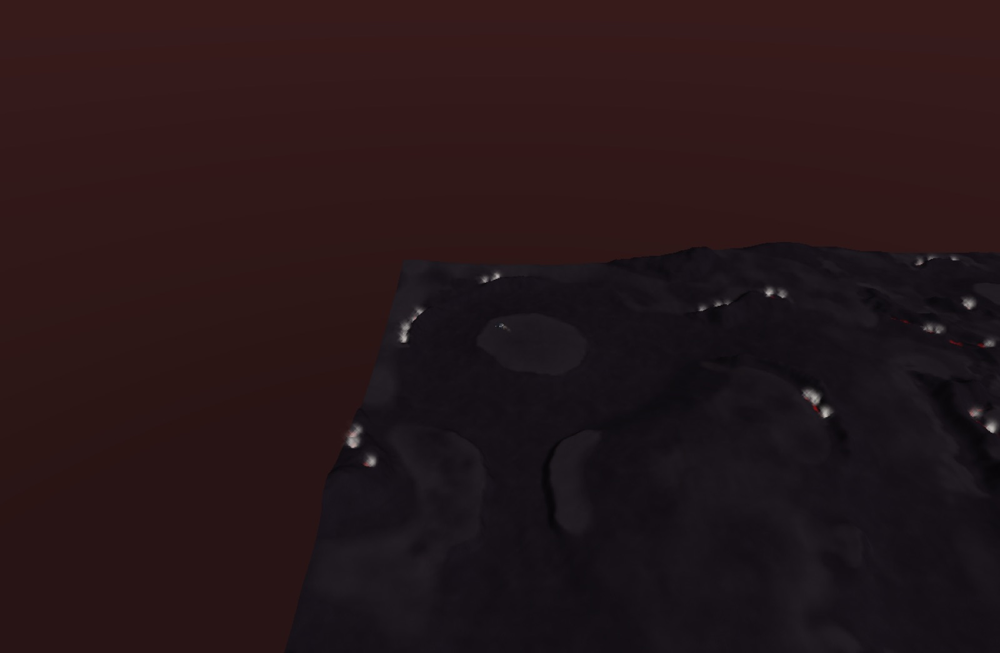
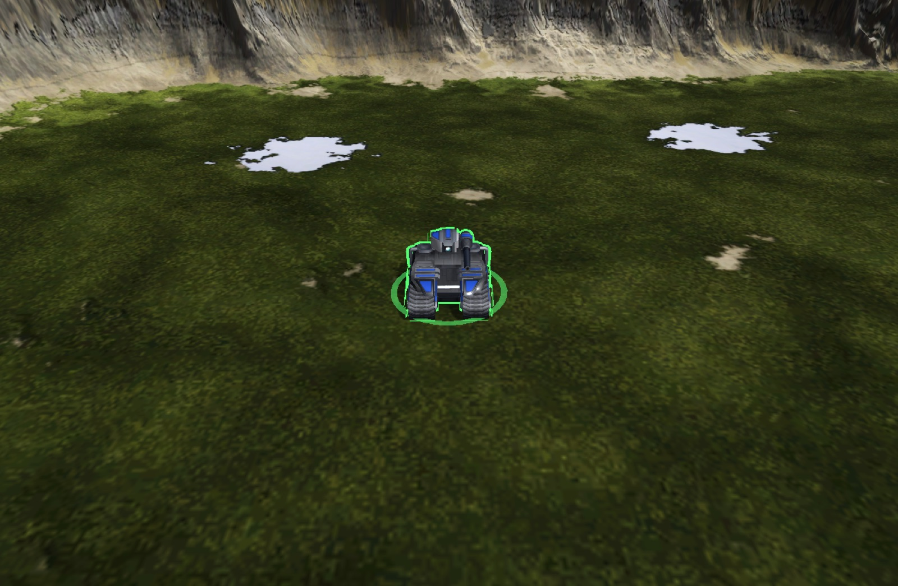
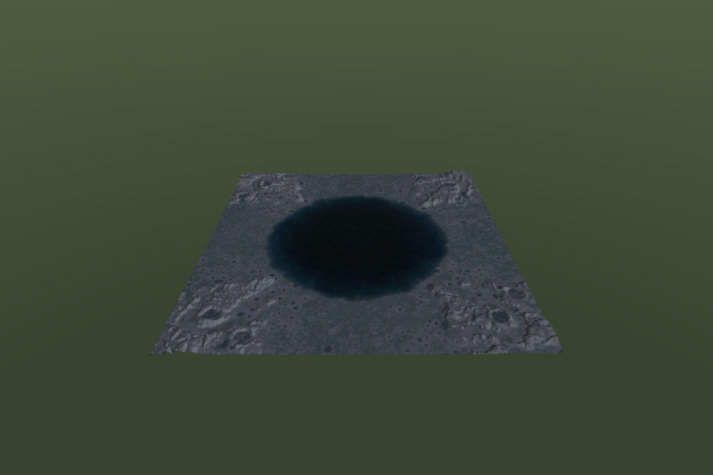

<!-- Generated and maintained by Claude -->
# recoil-metal — how it got here

The long version of the project's history: twenty milestones from an empty
window to a match that ends in a victory banner, then everything that closing the
gap between a pre-run sim and a window that plays turned into.

The short version, the build instructions and the flag reference are in
[`README.md`](../README.md). The design decisions and the rejected alternatives
are in [`ADR_DECISIONS.md`](../ADR_DECISIONS.md).

> Image paths below are relative to the repository root.

## Milestones

1. **Window + runtime-compiled shader.** NSWindow, `CAMetalLayer`, vsync via
   `CAMetalDisplayLink`. The shader pipeline is built from *source at runtime* —
   there is no Xcode on this machine, hence no offline `metal` compiler. This
   milestone existed to prove that toolchain story holds. **✔ done**
2. **SMF terrain.** SMF header + heightmap loader adapted from Recoil
   (`rts/Map/SMF/`), full-resolution heightmap mesh with central-difference
   normals, depth buffer, Lambert shading coloured by elevation, orbit camera.
   Verified against a real BAR map (Angel Crossing 1.4: 1024×1024 squares,
   1.05M vertices, 2.1M triangles). **✔ done**
3. **Textured terrain.** SMT tile decoding, an 8192x8192 BC1 ground atlas
   uploaded without transcoding, a real `mapinfo.lua` reader, and Recoil's
   fixed y=0 water plane. **✔ done**
4. **Benchmark harness.** Same map, both renderers, vsync off on both.
   **✔ done** — Recoil through zink: **7.416 ms/frame mean**. recoil-metal
   native: **0.554 ms**. A 13.4× gap, with the scope limits spelled out in
   [`docs/benchmark-m4.md`](benchmark-m4.md) — it is a full engine frame
   against a terrain draw, not the same work through two APIs. Enough headroom
   to justify continuing, which is what this milestone existed to decide.
5. **Units — Recoil content first.** `.s3o` loading, piece hierarchy, instanced
   rendering, DDS textures. **✔ done** — models render on the terrain:
   validated against all **2034** BAR `.s3o` models and **2552** `.dds`
   textures, placed at map start positions plus a deterministic scatter.
   800 instances of a 3980-triangle model costs 2.29 ms/frame (436 fps)
   against 0.69 ms for terrain alone. Both texture channels are honoured —
   tex1's alpha is the team-colour mask, tex2 carries self-illumination and
   reflectivity — shaded by a port of the engine's own model shader
   (`ModelFragProgGL4.glsl`). Several models per scene, ordered so each texture
   *pair* binds once a frame — the unit Recoil batches on too.

   Deliberately *not* glTF. The engine must eventually handle both Recoil and
   Forged Alliance content, but glTF is nobody's native format — it is FAR's
   Blender-produced intermediate, it costs a JSON dependency, and Recoil discards
   glTF animation tracks entirely. Supreme Commander's own `.scm`/`.sca` are plain
   fixed-stride binary (608 and 139 files on disk, 228-line reference reader) and
   carry the animation glTF loses. Both native formats decode into one shared
   model struct, so the FA path is additive rather than a rewrite. See
   [ADR-004](../ADR_DECISIONS.md).

6. **Supreme Commander maps.** `.scmap` v60, decoded byte-exactly and validated
   to EOF on all 60 retail stock maps. The heightmap lands in the *same*
   `HeightField` the SMF loader fills — that seam was designed for this at
   milestone 2 and cost nothing to collect on. Which loader runs is decided by
   the file's magic, not its extension, so nothing downstream knows which family
   a map came from. **✔ done** — geometry, terrain-type ground colour, and the
   per-map water plane (17 of the 60 stock maps are dry; Recoil's is a fixed
   plane at y=0), and start positions.

   Start positions were the surprise: `.scmap` carries none, and neither does
   the `_scenario.lua` that looks like it should. They live in `<map>_save.lua`
   as `ARMY_<n>` markers, alongside dozens of transport and mass markers. That
   file wraps every leaf in a data constructor — `VECTOR3( 672.5, 18.7, 346.5 )`,
   `GROUP { ... }` — so the Lua reader learned exactly six of them by name, which
   is data in call syntax rather than an interpreter. All 61 stock `_save.lua`
   files parse; the 54 skirmish maps yield starts and the 7 campaign maps
   correctly yield none, because their armies are spawned by mission script.

   **The ground splat, too.** SupCom bakes no ground texture: a `.scmap` names
   nine tiled layers that live in `env.scd` and embeds only the two masks that
   weight them, so the ground is assembled every frame from a recipe rather than
   loaded as a picture. Layer 0 covers the map; layers 1-8 are laid over it in
   order, weighted per texel by mask A's `rgba` then mask B's — a chain of mixes
   rather than a weighted sum, since a sum washes out wherever two strata meet.
   18 of the 57 loadable stock maps use the upper four strata, so mask B is not
   decoration.

   Three things the corpus decided rather than the plan. The stratum `scale` is
   **ogrids per texture repeat**, not repeats per map — the stock maps set the
   macrotexture to 128 on 256- and 2048-square maps alike, which is only sensible
   as a physical size. The layers are **not** a `texture2d_array` as planned:
   they come in eight distinct size/format combinations (256²-1024², BC1/BC2/BC3
   and uncompressed BGRA8), and an array demands one of each, so they bind
   individually — no transcode, no lost mips. And they need their **own repeating
   sampler**: the existing one clamps, correctly, because the atlas and both
   masks cover the map exactly, but a layer's uv reaches into the hundreds and
   under clamping every repeat past the first samples the edge texel, which
   renders as a smooth smear that reads as a missing texture rather than a wrong
   sampler.

   Two details come from the engine's own shader rather than from inference.
   Supreme Commander ships its HLSL in `gamedata/effects.scd`, and
   `effects/terrain.fx` contains `TerrainAlbedoXP` — exactly this path, eight
   strata through two masks. It confirms the blend chain, and settles two things
   guessing had got wrong or left out. The masks are **expanded**, not raw:
   `saturate(mask * 2 - 1)`, so the bottom half of the range means *absent*
   rather than *a little*, and using the raw value bleeds every stratum across
   the map at up to half strength. And the macrotexture (slot 9) is lerped over
   the result **keyed on its own alpha**, not on a mask channel and not
   multiplied — `lerp(albedo, upper.rgb, upper.w)`.

   Costs 2.063 ms GPU against 0.864 for the single-fetch path — twelve texture
   reads instead of one — and leaves the Recoil path untouched at 0.546 ms.

   Deliberately not done: the shipped per-map DXT5 normal map is parsed and
   validated but unused. Its convention is now known — `terrain.fx` reads it
   `.xyz * 2 - 1`, straight, with no swizzle — so what remains is wiring it into
   the terrain lighting rather than a question about the data.

   Maps above 2048 squares are still refused rather than half-loaded: their mesh
   alone would want ~800 MB and there is no LOD yet.

7. **Supreme Commander models and animation.** `.scm` loads into the *same*
   `Model` struct `.s3o` does — validated against all **1148** retail models
   (8379 bones, 1.23M vertices, 838471 triangles), cross-checked against an
   independent Python read. `.sca` gives what glTF would have lost: real
   keyframed bone animation, all **474** retail animations decoding to the byte.
   **✔ done** — a walk cycle plays on a Supreme Commander bot standing on a
   Supreme Commander map, next to Beyond All Reason units, in one scene and one
   binary.

   Two conventions genuinely differ between the families and `Model` records
   which one a model follows — vertices are bone-local in `.s3o` and model-space
   in `.scm`, and the team-colour mask lives in tex1's alpha versus
   `_SpecTeam`'s. Everything else is family-blind. See
   [ADR-005](../ADR_DECISIONS.md) and [ADR-006](../ADR_DECISIONS.md).

8. **Movable units.** Click to select, right-click to order. **✔ done** — the
   first thing in the engine whose state changes between frames.

   Everything before this was static once uploaded. Instances were baked into a
   GPU buffer at load and never touched again, and animation playback is
   deliberately a *buffer offset* into pre-baked poses so that a moving model
   costs no per-frame CPU work at all. Movement is what finally needs the other
   path, and it needs it safely: instance storage is `StorageModeShared`, so
   rewriting it while the GPU may still be reading last frame's copy is a plain
   data race. It became a three-deep ring with a completion-handler semaphore —
   the same `kMaxFramesInFlight` the offscreen benchmark already ran on — and
   drawing picks a slot by offset, exactly as animation picks a pose.

   The sim is movement and nothing else: units walk straight lines and pass
   through each other and through cliffs. Pathfinding and collision are the
   Stage B cliff below. It ticks at **30 Hz**, matching Recoil's own `GAME_SPEED`
   (`GlobalConstants.h:52`) — worth matching exactly rather than picking
   something convenient, because every speed and turn rate in the content is
   authored against that rate. Speed and turn rate default to BAR's Pawn (87
   elmos/second, and a `turnrate` of 1214.4 converted out of Recoil's circle
   divisions per frame to 3.49 rad/s), so the numbers are representative rather
   than invented.

   Three things fell out of building it that a plan would not have predicted.
   Facing is `atan2(dx, dz)`, not the usual `atan2(z, x)` — the vertex shader
   maps a model's local +Z to `(sin yaw, cos yaw)`, and swapping the arguments
   compiles, runs, and renders every unit walking sideways. Forward speed scales
   with `cos` of the remaining heading error, which makes a unit pivot in place
   before setting off instead of driving away and arcing back, and needs no
   arbitrary "turn until aligned" threshold because the cosine already is one.
   And `setUnits` **reorders** batches by texture pair, so the caller's batch
   index is not the renderer's slot index — pushing instances by the wrong one
   silently moves the wrong model.

   The nearest-corner ground sampler from milestone 5 had to go: it is exact at
   every corner and wrong everywhere between, and a unit crossing a square held
   its height for four elmos and then jumped the whole difference. Placement and
   the sim now share one interpolating sampler, because if they disagree about
   where the ground is a unit jumps the instant it is first stepped.

   Picking is arithmetic on the heightfield rather than a read-back of a depth
   or ID buffer: marched at half-square steps and bisected, which costs a GPU
   round-trip nothing and makes "does clicking there select that unit" a test
   instead of something to squint at.

   
   

   Deliberately not done at the time: **slope alignment** (`UnitInstance`
   carries a single yaw by design, so tilting to the terrain means growing a
   struct the shader reads verbatim). The other two deferrals — per-instance
   animation phase and foot sliding — are milestone 9.

9. **Squads, pathfinding, and the unit shader's last guess.** **✔ done.**

   **Each instance gets its own animation phase.** Playback used to bind the
   bone buffer at one pose's offset for the whole batch, so every unit in it
   shared a clock and a squad walked in perfect lockstep — which reads as one
   unit drawn several times. The whole keyframe buffer is now bound and the
   vertex shader indexes it per instance. ADR-006's bargain survives: poses are
   still baked once at upload, and nothing is written per frame.

   **The walk cycle is paced by ground covered, not by wall time.** A clock and
   a walk cycle disagree constantly — a unit standing still keeps striding, one
   pivoting on the spot keeps striding, one that has arrived strides forever.
   Distance has none of those cases. The stride is `speed * duration`, the
   distance one cycle covers at full speed, which is the assumption the
   animation was authored under; at top speed the cadence is exactly what the
   clock gave, and every slower case falls out for free. A batch declares which
   of the two drives it, so headless captures stay on the clock and `--time`
   keeps meaning something.

   **Units route instead of walking through things.** Passability is a coarse
   grid — 8×8 heightmap squares per cell, so a 1024-square map searches 16k
   nodes rather than a million — from two of the engine's own rules. A face's
   slope is `1 - normal.y`, the quantity Recoil's slope map holds
   (`ReadMap.cpp:778`), compared against `1 - cos(clamp(deg, 0, 60) * 1.5)`
   exactly as `MoveDefHandler.cpp:84` computes it — the 1.5 and the clamp mean a
   unit def's nominal 0..60 really spans 0..90 degrees of ground. Water is a
   *depth* limit rather than a line, because a unit fords shallows. Both
   defaults are BAR's Pawn again: `maxslope 17`, `maxwaterdepth 12`.

   The search is A* with an octile heuristic; diagonal steps require both
   orthogonal neighbours open, or units clip the corners of cliffs. An
   unreachable destination means the unit stays put rather than setting off into
   the sea — on an island map like Angel Crossing that is 27 of 120 units
   standing still, which the app says out loud so it does not read as a bug.

   **And `_SpecTeam`'s channels are no longer guessed.** ADR-005 left green and
   blue unused because nothing verified said what they held. `effects/mesh.fx`
   settles all four: red multiplies the environment reflection, green scales an
   additive Phong highlight, blue is emissive at `glowMultiplier` 2.0, alpha is
   the team mask. The old reading conflated two independent channels — it drove
   both the highlight and the reflection from red — and rendered every emissive
   surface unlit. It also exposed a fallback bug: a model with no `_SpecTeam`
   defaulted to alpha 1, which under that layout means *paint the whole thing in
   the team's colour*. Both normal-map conventions came out of the same read and
   they differ, so neither could have been assumed from the other: model normal
   maps are DXT5nm-swizzled (`.gaa`, Z reconstructed), the per-map one is
   straight `.xyz`. See [ADR-012](../ADR_DECISIONS.md).

   Still not done: slope alignment, and unit-unit collision — units mass at a
   rally point by standing inside each other.

10. **Content, volume, scale and light.** **✔ done** — five things that each
    removed a lie the renderer was telling.

    **Units read their own definitions.** BAR ships 968 Lua files; 943 units
    parse out of them. Speed is already elmos/second in the modern field, turn
    rate is circle divisions per *frame* over 65536 to the circle, and
    footprints carry the engine's scale of 2 plus its lower clamp — which earns
    its keep, since several units declare `footprintx = 0` and would otherwise
    occupy no space at all. 36 files are refused, every one for the Lua
    reader's stated contract: a value needing evaluation, an expression calling
    into the engine, or units built in a loop. Aircraft turned out to carry a
    `turnradius` and no turn rate at all, so `canFly` is read too.

    **Units have volume.** A rally point used to be 93 models standing inside
    each other. Overlapping pairs are pushed apart by half the overlap each,
    over a uniform grid two radii across. Exactly coincident units — which is
    precisely what a rally order produces — take a direction from their pair of
    indices, so a stack fans out instead of collapsing onto one axis.

    **Large maps load.** Above 2048 squares a map was refused outright: the
    mesh wanted 806 MB. The builder now decimates at load, so a 4096-square map
    costs what a 1024-square one does. The cap moved to 8192 and now bounds the
    *heightfield*, which is not decimated. Lifting it also made an old corpus
    test come true — it asserted the embedded normal map is always one DXT5
    tile, noting that only the three 4096-square maps store four and that they
    were refused for size "so that the day it is not, this says so". It did.

    **Shadows.** A depth-only pass from the sun, four-tap filtered through a
    comparison sampler. Two things had to be right and the first attempt got
    both wrong. The light box follows the *camera*, not the map: covering the
    whole map is 4 elmos per shadow texel and a depth range spanning the map's
    diagonal, so the bias needed to stop the ground shadowing itself is most of
    a tank's height — the shadow lifts off its caster and nothing renders. And
    the bias is applied in the shader, scaled by how obliquely the sun strikes
    the surface, because a single constant either leaves oblique faces striped
    with acne or lifts the shadows off everywhere else.

    **Water.** Was a flat translucent quad. It is now a grid whose vertices
    carry their own depth, so shorelines fade rather than ending in a line;
    shallow water is green-grey and deep water blue, because water absorbs the
    red end first. Reflectance follows Schlick — 0.02 head-on, a mirror at
    grazing angles — which is most of what makes water look wet. The two wave
    trains run at oblique, incommensurable angles: aligned to X and Z their
    crests intersect on a regular lattice and open water reads as graph paper.

    Shadows cost 1.060 → 1.668 ms GPU on 200 units at 1920×1080 (1492 → 783
    fps); water is free within noise at 1.681 ms. The shadow pass re-submits
    all 2.1M terrain triangles even though the light box covers a fraction of
    the map, so culling to the box is the obvious next saving.

    Also in: an asset search path with `.sdz` extraction, slope alignment, and
    multi-unit selection. Still absent: per-unit passability (one grid serves
    the whole scene, so a unit's own `maxslope` is not honoured), and units of
    different models still pass through each other.

11. **Closing the loose ends.** **✔ done** — five items that were each a known
    lie or a measured cost.

    **Collision sees across models.** Instances are held one array per model,
    and the separation pass ran once per array — so two units of *different*
    models could stand in exactly the same spot with neither pass able to see
    the other. It now takes a list of groups and flattens them into one index
    space.

    **Each unit routes on the map its own limits see.** Definitions had
    supplied `maxslope` and `maxwaterdepth` since they were read, but one grid
    served the whole scene. Grids are now built per distinct pair of limits and
    cached — keyed on the limits, not the unit type, since the grid depends on
    nothing else. On Angel Crossing that is 59% of the map walkable to BAR's
    Pawn against 55% to its Stumpy tank.

    **The shadow pass is culled to the light box** — 1.082 → 0.705 ms GPU on a
    close camera, a third off. The terrain is emitted in 64-square chunks, each
    a contiguous range of the index buffer with its own bounds. Two details
    matter: chunks are emitted chunk-by-chunk rather than row-by-row, or their
    triangles are not contiguous and cannot be drawn alone; and survivors are
    merged into runs, without which culling trades one draw of the terrain for
    one per chunk and is *slower* whenever the camera is far enough back to
    keep them all — which is exactly what the first version measured.

    **A sky, and water ported from `water2.fx`.** Every other shader here is a
    port with a `file:line` citation; the water was mine. Three of the engine's
    constants are not what one would guess: `waterLerp` is
    `clamp(depth, 0.3, 0.3)` — a *constant* 0.3 of `waterColor`, not a depth
    ramp — the depth dependence living in `skyreflectionAmount * saturate(depth
    * 10)` instead; and Fresnel is bias 0.1 with power 1.5, far softer than a
    physical Schlick 5, which is why the engine's water reflects noticeably
    even looked at straight down. The sky is `AtmospherePS`'s horizon-to-zenith
    lerp, drawn as one full-screen triangle at the far plane, and the water
    reflects the same function — so the sea and the sky above it agree.

    
    

    Still absent: per-map sky and water colours (a `.scmap` carries them in its
    skybox block, which the loader parses but does not expose), refraction and
    planar reflection, and dynamic per-patch terrain LOD.

12. **Culling, per-map environment, and real water.** **✔ done.**

    **Both terrain passes cull now**, sharing one cull-and-merge helper and
    differing only in the predicate — the light's box for the shadow pass, the
    view frustum for the visible one. Frustum culling took the close camera
    from 0.702 to **0.344 ms**. Plane extraction lives in `core/` with tests,
    because two details are easy to get wrong and invisible until they bite:
    Metal's clip depth runs 0..1, so the near plane is row 2 alone rather than
    OpenGL's row3 + row2 — use the OpenGL form and everything near the camera
    vanishes — and the box test must keep anything that merely *straddles* a
    plane, or terrain clips at the screen edge as the camera turns.

    **Detail varies with distance.** Each chunk carries three index sets and
    the draw picks by distance: whole-map view 2.447 → **1.472 ms**. Not
    stitched — neighbouring chunks at different levels can crack in principle,
    though the transition is eight chunks out where a one-level difference is
    subpixel, and none was visible. The honest fix is skirts.

    **Maps state their own sky and sea.** A `.scmap` carries a lighting block
    and a water block; both were parsed only to prove the layout, so every map
    got `water2.fx`'s stock values and every horizon looked the same. Reading
    them means a desert map gets a warm sandy sky and a coastal one green-grey.
    Validated across all 60 retail maps — and the assertion that matters is
    that more than five *distinct* fog colours come back, since a parse landing
    on a constant passes every range check.

    **Water refracts.** On a tile-based GPU the fragment shader can read the
    colour already in the render target, so the scene behind the water needs no
    second pass at all — that is the engine's refraction input arriving free.
    It is absorbed by Beer-Lambert rather than lerped toward a painted colour,
    so a shallow sandy bottom stays sandy and a deep one goes blue without
    either being painted that way. Planar reflection is a real second pass and
    the expensive one, and its reflected camera cannot be an `OrbitCamera`:
    that type clamps pitch positive and a mirrored camera looks *up* from below
    the surface.

    

    Selection rules moved to `core/scene/Selection.hpp` with nine tests. They
    had lived inside an AppKit callback, where the only way to check whether
    shift-click adds was to click.

13. **Interface, detail, and two quality switches.** **✔ done.**

    **Selection rings** — the one piece of interface this renderer draws.
    Selection had been a white tint on the model; a ring on the ground reads
    better, and it *conforms* to the terrain rather than being a flat disc
    tilted by the surface normal. That matters more than it sounds: a ring is 8
    to 40 elmos across and a heightfield square is 8, so a flat ring spans
    several squares of real relief and buries a third of itself in any slope
    that is not planar. Each vertex takes its height from the ground under
    *it*, which is also why a ring on a hillside stays level with the hill
    instead of with the unit standing on it. Pure geometry, so ten tests pin
    the shape — including that a ring wider than twice its radius clamps
    rather than folding through the centre into a bow tie, which happens for
    real, since a two-square footprint is a radius of eight elmos.

    

    **Per-stratum normal maps**, ported from `terrain.fx`'s `TerrainNormalsXP`.
    A `.scmap` names a normal map beside each stratum's albedo — nine against
    ten, the macrotexture having none — and the loader had been parsing them
    and dropping them. They put grain in grass and relief on gravel at the
    scale a heightfield sample (8 elmos) cannot express at all.

    | with | without |
    |---|---|
    |  |  |

    Two things the engine's own shader settled and one it could not. It
    confirmed the blend is the same chain of lerps as the albedo. It revealed
    an asymmetry that looks like a typo and is not: `TerrainAlbedoXP` expands
    its masks — `saturate(m * 2 - 1)` — while `TerrainNormalsXP` twenty lines
    later reads them **raw**. What it could *not* settle is which channel points
    up, because it hands the sample straight to a lighting function whose own
    space is muddled by `.xzy` swizzles. So that was **measured** instead: a
    corpus test reads the block endpoints of thirty real stratum normal maps
    and asserts blue is the channel sitting near +1. A normal map read on the
    wrong axis lights bumps as dents, which survives a look at the screen.

    **Skirts** close the per-chunk LOD cracks milestone 12 shipped with. Both
    sides of a boundary need one — where a chunk's rim is above its neighbour's
    chord its own skirt covers the gap, where below, the neighbour's does — and
    the depth is derived from the worst gap a coarse chord can leave along that
    chunk's rim, not a constant. A constant deep enough for a cliff would hang
    into open air wherever the ground beside a chunk falls away. Flat ground
    gets a skirt of depth zero. Cost: +11.2% vertices and +0.05 ms.

    **A fix that no screenshot could have found.** Milestone 12's per-chunk LOD
    emitted each chunk's three levels back to back, which put chunk N's coarse
    ranges between chunk N's fine range and chunk N+1's — so no two chunks were
    ever adjacent at the level they were drawn at, and the cull-and-merge from
    milestone 11 had not fired since. Terrain was one draw per chunk for a
    whole milestone. A renderer issuing 256 draws where one would do renders an
    identical image; it took asserting the adjacency the merge depends on,
    which is now a test.

    **Two quality switches**, `r` and `n` live, or `--no-reflections` and
    `--no-stratum-normals`. Both features are worth their cost only if you can
    see what they buy, and a side-by-side of two runs cannot show a difference
    moving:

    | | GPU | vs off |
    |---|---|---|
    | planar reflection | 2.527 ms | +0.50 ms |
    | stratum normals, naive | 4.604 ms | +1.34 ms |
    | stratum normals, skipping absent and zero-weight | 3.529 ms | +0.21 ms |

    That last row is two `continue`s. A map naming five strata was sampling
    four slots bound to a fallback texture whose contents were then multiplied
    away, and a stratum's weight is zero across most of the map — both skips
    leave the image bit-identical in intent, and take 6.5× off the feature's
    cost.

14. **Scenery, and the answers to three open questions.** **✔ done.**

    **Props.** The map corpus turned out to be full of scenery nobody had counted.
    Feature rendering had been recorded as blocked because BAR's aw04 declares zero
    features in its SMF block and places its objects through a runtime Lua gadget —
    but the Supreme Commander side was never looked at, and **59 of the 60 stock
    maps carry props: 418 942 of them**, a median of 4355 per map and 46 971 on the
    busiest, across 207 distinct blueprints. The section was already being walked to
    prove the parse reached EOF, so reading it replaced four skips with four reads.

    | | |
    |---|---|
    |  |  |
    | **5182 props from 19 meshes and 5 textures** on SCMP_009 | Alpha cutouts up close — the leaf shape, not the quad |

    A prop is a static model with one texture, so it shares the unit pipeline and
    differs in two flagged things: no shading texture, and its albedo's alpha is a
    CUTOUT rather than a team-colour mask. That second one matters more than it
    sounds — both families keep a team mask in an alpha channel somewhere, so read
    as a mask a palm frond renders as a solid green card in the player's colour. It
    is a `discard` rather than a blend because scenery is drawn in arbitrary order,
    and a cutout is order-independent, which is what keeps 14 000 trees one draw.

    What it does *not* share is the unit list, for a reason about the sim rather
    than the GPU: everything in there is ticked, collided and pickable, so a tree in
    it would be shoved aside by passing infantry and would accept a move order.

    Two scale conversions, and both are needed. `UniformScale` in the blueprint
    takes the mesh to ogrids — cross-checked against the blueprints' own `SizeY`,
    the collision height in ogrids, which says 1 for both a palm and a pine whose
    meshes measure 0.96 and 1.18 once scaled — and an ogrid is 8 elmos. Miss the
    second and a pine is 1.2 elmos tall: a scatter of dark specks that reads as a
    texture problem rather than a units one. See [ADR-024](../ADR_DECISIONS.md).

    **Props are culled by distance, per prop, using the cutoff their own blueprint
    states** — which is what makes zooming out free. A blueprint's LOD table gives a
    cutoff per level, and across the 335 shipped ones the furthest runs from 10 to
    1000 ogrids: a shrub stops being drawn at 800 elmos where a landmark tree
    survives to 8000. So the scenery thins from the small detail upwards as the
    camera pulls back, and at a whole-map framing every prop is past its own cutoff.

    | view | props on | props off | before the cull |
    |---|---|---|---|
    | SCMP_009 whole-map, 5182 props | 4.036 ms | 4.051 ms | +2.8 ms |
    | SCMP_005 whole-map, 46 971 props | 4.156 ms | 4.263 ms | +6.2 ms |
    | SCMP_009 at a working zoom | 10.700 ms | 10.530 ms | +2.8 ms |

    Nothing pops, and not by luck: because the cutoffs are graded per prop the
    disappearance is spread over the zoom range rather than being a cliff. Measured
    as the share of pixels the scenery accounts for while pulling back — 12.1% at a
    close zoom, 8.6%, 2.6%, then 1.11%, 0.33%, 0.05% and nothing. The last props to
    go are contributing a twentieth of one percent of the frame.

    Reading a blueprint needed two things of the Lua data reader. Its
    call-with-table allow-list grew from `GROUP` alone to the four names that appear
    across 335 blueprints and 61 stock maps. And `#` became a line comment, which is
    **not Lua** — real Lua allows it only on a first line and otherwise reads it as
    the length operator — but 47 blueprints use it as one anyway, so the game's own
    reader must. Accepted only at the start of a line, where all 47 sit; anywhere
    else it would swallow the rest of a line and quietly drop a field.

    **Dust**, on a new particle pass, and the first thing here that is neither
    terrain, model nor interface.

    

    What the CPU uploads is a particle's *history* rather than its state — where it
    was born, the velocity it was born with, how long ago — and the vertex shader
    works out the rest. So nothing on the CPU integrates a position, and the quad is
    expanded from the vertex id and turned to face the camera in the shader, which
    means no geometry uploaded and no index buffer. 1983 particles cost 1.428 ms
    against 1.423 without: free, within noise. Blending is premultiplied, so the one
    pipeline covers translucent dust *and* an additive spark
    ([ADR-025](../ADR_DECISIONS.md)).

    Three mistakes worth recording, all now tests. A puff born exactly on the ground
    is coplanar with the terrain drawn there and loses the depth test — totally and
    silently, since the draw is issued and the count is right and nothing appears.
    The radial falloff was squared, which shrank a puff's visible core to a fraction
    of its quad. And the emission was gated on `MoveState::speedElmosPerSecond`,
    which is a unit's *top* speed rather than its current one, so every parked unit
    smoked — caught by a line of output disagreeing with itself: `0 of 60 units
    routed` next to `840 dust particles still in the air`.

    **Order markers.** A right-click leaves a crossed amber ring that shrinks toward
    the point and fades. A cross rather than a second ring: it appears on the same
    ground as a selection ring within a second of it, so hue alone is one
    distinction too few.

    

    The buffer these ride was named for rings alone, which stopped being true with a
    second kind of thing in it — hence `GroundDecals`. No pipeline, buffer or draw
    call was needed for the new decal, because the renderer already took arbitrary
    ground-conforming coloured triangles.

    **And the three open questions milestone 13 left.**

    *Should the selection tint stay?* No. It was free — the team-colour field is per
    instance and already uploaded — but in an RTS a unit's colours are its
    allegiance, so repainting that channel to mean "selected" makes a unit appear to
    change sides for as long as it is in the set. Two cues for one piece of state is
    a redundancy worth paying for; two *meanings* on one channel is not. Rings only
    now, and the click handler lost 40 lines ([ADR-021](../ADR_DECISIONS.md)).

    *Should the quality switches default to looks-best or costs-least?* Looks-best,
    and there is now a settings file to say otherwise. What that obliges is that a
    benchmark states which switches were on, since two of this renderer's own
    numbers are otherwise not comparable — which it now does.

    *And the LOD thresholds, retuned now that the cull-and-merge actually fires.*
    The premise turned out to be wrong in a useful way: band boundaries do break
    runs, and it does not matter. The shipped 8/20 issues six draws against 6/14's
    one and is still **0.13 ms slower**, because it draws 80% more triangles — a
    whole-map framing is vertex-bound and a handful of draw calls does not register
    against 100k triangles.

    | near/far | whole-map GPU | draws | triangles | vs no LOD | focus-60 diff |
    |---|---|---|---|---|---|
    | off | 2.598 ms | 1 | 2 097 152 | — | — |
    | 8 / 20 (was) | 1.510 ms | 6 | 235 520 | 0.385/255 | 0.000/255 |
    | **6 / 14 (now)** | **1.380 ms** | **1** | **131 072** | 0.452/255 | 0.000/255 |
    | 4 / 10 | 1.384 ms | 1 | 131 072 | 0.452/255 | 0.258/255 |

    6 is where the near threshold stops being free: at a mid-range working camera it
    renders an image byte-identical to full detail while 4 already moves 1.23% of
    the pixels. 47% off the whole-map frame for a mean difference of 0.45/255. The
    thresholds are deliberately *not* derived from a projected-error budget, which
    was the first attempt and demands a threshold four times the width of the map —
    the model says "never use LOD" and the screenshots say the error is invisible
    under ground texture and shadow ([ADR-022](../ADR_DECISIONS.md)).

    The merge itself moved out of the renderer into `core/mesh/ChunkDraws.hpp` with
    ten tests, because a draw count is the one part of a frame that has to be
    asserted rather than looked at — which is exactly how milestone 13 lost it for a
    whole milestone.

    **Refraction, built and switched off.** The water can now bend what is under it:
    the offset needs a copy of the colour target, since a framebuffer fetch reads one
    pixel and no other, so the pass splits in two around a blit (+0.17 ms on aw04,
    +0.28 on a Supreme Commander sea map). That part works. What it reveals is that
    the field being bent by is two analytic wave trains standing in for the engine's
    four scrolling normal maps — and moving a screen-space sample by a field that
    regular draws the field's own lattice across the water: rings tens of pixels
    across at swell frequency, a diagonal hatch at ripple frequency, at every
    strength down to a quarter of the engine's. So it ships off, and the blocker was
    never the copy ([ADR-023](../ADR_DECISIONS.md)).

15. **Scenery that pays for itself, and three format facts.** **✔ done.**

    Seven follow-ups from milestone 14, and the interesting part is how many of them
    turned into corrections rather than features.

    **Props are drawn at the level their blueprint states**, not always at their
    finest. Each declares a mesh and a cutoff per level — 30 / 175 / 300 ogrids for
    the pine placed more often than anything else — so full detail belongs within 240
    elmos. On the busiest stock map at a mid zoom that is **8.50 ms against 11.31**, a
    quarter of the frame, from data already being parsed. The levels of one blueprint
    share an instance buffer, because a prop is drawn at exactly one of them.

    **Prop normal maps**, once their convention was measured. All 221 are BC3 with
    red, green and blue EQUAL — one axis replicated across the colour channels, a
    second in alpha, the third reconstructed — where a stratum map puts z in blue near
    255. The tangent frame comes from screen-space derivatives rather than per-vertex
    tangents, which `.scm` does carry: after UV1 was retained for unit normals, plumbing those
    through would grow every model's vertex from 44 bytes to 68, 2000 BAR unit meshes included.
    What is *not* settled is which channel is x and which is y ([ADR-026](../ADR_DECISIONS.md)).

    **The ambient effects a map marks** — steam, mist, bubbles, blowing sand and snow.
    Eight blueprints draw nothing at all: `UniformScale` is 0 and `MeshName` points at
    an editor marker. Eight of the 60 stock maps place them, 90 of them on one map.
    What they look like is not in the blueprint — that lives in Lua — so the kind is
    read and the appearance is a named stand-in, as ADR-018's water and sky are.

    

    **Trees cast tree-shaped shadows**, on a pipeline of their own — the only one in
    the shadow pass with a fragment shader, which exists to run one `discard`.
    Milestone 14 had recorded a decision *not* to, on the grounds that it would cost
    every shadow caster its early-depth rejection. That was wrong: early-Z is a
    property of the pipeline, not the pass, so only the props pay. +0.50 ms.

    **Selection outlines**, which is what a ground ring cannot do at a low camera
    angle where a crowd's rings hide behind the units standing on them.

    

    An inverted hull — the unit's own geometry pushed out along its normals, front
    faces culled — because a stencil would mean a depth-stencil format on every
    pipeline and an id buffer would mean another attachment. The width is applied in
    clip space so it is three pixels wherever the unit is. It must be drawn BEFORE the
    units and write NO depth: with depth write the shell wins at every crease, where a
    hard-edged model's split normals tear it open, and the unit's own surface loses.

    **And three things the data said that the plan did not expect.**

    *SMF features are a dead end, now with evidence.* Five BAR maps — one already here
    and four off BAR's own validated index — all declare the standard sixteen
    `TreeTypeN` entries and place none of them. The only features any of them place
    are two GEOVENTS on Altair Crossing, which are build sites rather than scenery. So
    the item is retired rather than unblocked, which is a better answer than three
    milestones of "check more maps".

    *The skybox block's mid colour is three bytes, not four* — and the walk that read
    four still landed exactly on EOF for four milestones, because the extra byte was
    swallowed by the C string after it. `endsExactlyAtEof` proves the total, not the
    parts. Corrected, the block's cirrus colour varies per map and now tints each
    map's zenith, where every map used to share one blue-grey.

    | | |
    |---|---|
    |  |  |
    | **Each map's own sky**, from the block's cirrus colour | Props at the level their blueprint asks for |

    *And a pass can be deleted by an edit that never mentions it.* Rewriting the prop
    draw between two anchors swallowed the ground-decal draw that sat between them:
    the pipeline was still built and still released, nothing drew with it, and 374
    tests stayed green. It surfaced only when the outlines put a second cue beside the
    missing one.

16. **Supreme Commander units read their own definitions.** **✔ done** —
    `--units UEL0201_unit.bp 40 --march 4096 4096 30` puts UEF medium tanks on
    `SCMP_009` at 27 elmos/s, 1.57 rad/s and a 3.6-elmo collision radius, every
    number read from the file rather than chosen.

    

    Half of what the milestone planned turned out to be wrong, and the corrections
    are the interesting part. **The model had been 14× too big since milestone 7** —
    `.scm` vertices are not in ogrids, and `Display.UniformScale` is the missing
    factor, exactly as for props. It is stored as ONE combined `meshToElmos`,
    because the two-step version has already been got wrong here once.
    **`SizeX`/`SizeZ` are at the file's ROOT, not under `Footprint`** (568 of 568
    against 363), and they are a different quantity from the build footprint: a
    collision box in fractional ogrids against whole squares. That forced the
    collision radius to become a stored float — 418 of 568 sizes are fractional and
    154 are under one ogrid, the smallest 0.01, which as whole squares would inflate
    that unit's radius from 0.04 elmos to 4. **Passability comes from the motion
    class**, and Water and SurfacingSub are *refused* rather than approximated,
    because they need the inverse of the ground grid and a ship routed over it
    drives across dry land.

    The tick moved to **10 Hz** with this milestone, which is the last moment that
    change was free — every constant tuned after it would have had to move too. It
    immediately exposed two facts sharing one number: BAR's `turnrate` is per
    *Recoil* frame and wants 30, not our rate.

    The two items carried out of here landed later: a **VFS with archive priority**,
    so the 25 blueprints that name a mesh by path resolve against the shipped
    `.scd` archives instead of a documented extraction one-liner ([ADR-044](../ADR_DECISIONS.md)),
    and **LOD switching** — 563 blueprints declare a cutoff and a coarser mesh, and
    a distant unit now draws the one its own blueprint asks for.

17. **Armies, and units that belong to one.** **✔ done** — an `Army` carries
    index, faction, colour and alliance, ownership sits on every instance, and
    selection refuses anything that is not yours. Each army spawns on one of the
    map's own `ARMY_<n>` markers with its faction's ACU. `--factions` picks each
    seat's side, so mirrors and matchups are both one flag.

    Reading the rest of the marker table while there was the cheap part and the
    useful one: 3508 `Mass` markers and the hydrocarbon sites are what milestone 19
    builds on, and the shipped nav graph is a free reference to check A* against.
    The stock maps place **no units at all** — all 61 army `Units` groups are empty —
    so spawning is the engine's job, not the map's.

18. **Weapons, projectiles, and damage.** **✔ done** — the first milestone where a
    unit can lose something. Rate of fire, damage, radius, range, muzzle velocity
    and the turret bones come from the blueprint's own `Weapon` table; projectiles
    fly direct or ballistic on the fixed tick; damage is a sparse profile keyed by
    an armour class resolved at load ([ADR-033](../ADR_DECISIONS.md)), and a death
    leaves a wreck. The fight unfolds tick by tick rather than resolving at once —
    the live proof is milestone 20's match, which spends 336 shots and 32 units to
    reach its banner.

    (The milestone's own demonstration was eight commanders marched into the map
    centre to mutual destruction. That command no longer produces a fight on the
    current build: they walk to the centre and stand there. Recorded as owed rather
    than quietly dropped — combat demonstrably works, so this is about what
    `--march` gives a commander that already has a build order, not about weapons.)

    Three corrections the tests forced, each now a comment in the code: reloads ran
    10% slow because the counter was checked before being decremented; a flat shot
    detonated at the muzzle, because **a unit's position is at its FEET** and a level
    shot therefore began at ground height; and with only a ground-height test every
    weapon then flew over its target and missed. Emergent and honest — nothing leads
    a target, so distant moving units are hard to hit and close ones are not.

19. **Economy and building.** **✔ done** — mass and energy income, storage and drain
    per army; the map's `Mass` markers become extractor sites; build costs come from
    `BuildCostMass`, `BuildCostEnergy` and `BuildTime` against a builder's
    `BuildRate`, with consumption gated on income, so a stalled economy *slows*
    construction rather than cheating. The ACU and engineers raise structures, and a
    land factory builds units and rolls them off the pad.

20. **A skirmish that ends.** **✔ done, and provable in one line:**
    `--skirmish --armies 2 --play 700 --screenshot` plays the whole match from spawn
    to the victory banner, deterministically — the same command at any shorter
    duration is a screenshot of that stage of the same match. The opponent's
    extractor lands at 5.9s, power at 18.5s, a second extractor at 25.0s, the land
    factory at 55.0s and the first tank off it at 68.0s; the attack goes in at
    432.1s with all 29 tanks routed, and `team 1 WINS` at 594.4s after 336 shots and
    32 units destroyed. Your own commander does nothing while you are not there to
    play it, which is the honest shape of a headless run: seat 0 is the player's.
    The staged proof is in [A match](../README.md#a-match-milestone-20) in the README.

    Those timings are current, not historical — `make match SECONDS=<n>` re-runs the
    same match to any moment of it, and `make verify` replays 7000 ticks against
    `docs/golden-p1.log` and reports `determinism: MATCH`. They have moved once
    already: the wave used to be a hardcoded 20 tanks launching at 335s, and now
    that it sizes itself from the unit it is made of, it is 29 and goes in at 432s.

    Most of what the milestone required was not in its plan.

    **The opponent is `core/sim/BuildOrder.hpp`** — three pure functions over a
    caller-built `ArmyView`, labelled a scripted build order in the source rather
    than an AI. Even its wave size is the blueprints' own arithmetic rather than a
    chosen number: a 100-dps commander kills a 300 hp tank every 3 s, so N tanks at
    24 dps land `72·N(N+1)/2` damage before dying, and the wave is the smallest N
    that clears the commander's hp with a stated margin — with a test that
    recomputes that minimum, so the constant cannot drift into taste. It was a
    hardcoded 20 when the milestone closed; sizing it from the unit it is actually
    made of is what later moved it to 29.

    **A finished construction had to BECOME A UNIT.** Milestone 19 ended at income
    bookkeeping; nothing it built ever stood on the map. **Income is now recomputed
    from what is standing** each tick rather than accumulated when builds finish, so
    a structure that dies takes its production, upkeep and storage with it — which
    the incremental version silently got wrong. And **armies start with their
    storage banked**, as the game does; the empty start survived milestone 19 only
    because the extractor was the sole build.

    **The match found a weapons bug no corpus test could.** The commander carries
    `ManualFire` (OverCharge, 12000 damage) and `EnabledByEnhancement` weapons
    (TacMissile, 2048-elmo range), and the loader read both as ordinary guns — so
    the player's commander sniped the tank column from a fifth of the map away and
    killed 19 of 20 before anything arrived. Both flags are read now, and both
    weapons wait for the order and the upgrade that milestone 20 never gives them.

## Beyond 20 — the window that plays

Milestone 20's match was *pre-run*: the sim ticked headlessly and handed a finished
scene to the window. Everything below is what closing that gap turned into, plus the
depth the match needed once it was watchable rather than screenshotted. The full
design and the rejected alternatives live in [`ADR_DECISIONS.md`](../ADR_DECISIONS.md)
(ADRs 037–049); this is the inventory.

**The window fights.** The frame loop runs the sim tick, and the renderer
interpolates each drawn transform between the previous and current sim state by the
fraction of a tick elapsed — so the picture is continuous while the simulation stays
discrete at 10 Hz. Interpolation is presentation only and never feeds back into sim
state; `--no-interpolate` turns it off to see the difference.

**An interface with the game's anatomy, in our own instrument language.** A HUD, a
selection roster grouped by type in first-appearance order (sorting by count would
reorder the row as units die, which destroys the by-position reading a tiled roster
exists for), and a build tray that reads *and acts* — click a cell to arm, click the
ground to place. The **minimap is the map**: the `.scmap`'s own embedded 256²
preview, skipped for four milestones on a comment that called it "always 256×256
RGBA8" and was never checked — it is a DDS container, uncompressed BGRA, on all 60
stock maps. The tray draws **the archives' own icons**: 538 ship in `textures.scd` at
64×64 DXT5, and because 64 is a multiple of the 4×4 block, packing them into one
atlas is a memcpy of compressed blocks rather than a decode, a blit and a
recompress. The **placement ghost** is a batch with no units in it
([ADR-042](../ADR_DECISIONS.md)), coloured by `sitePlaceable` — the same call the
placement itself makes, so the ghost and the order cannot disagree about a spot.
`--ui faf` wears the game's own chrome instead.

**Orders grew a vocabulary.** Attack-move and patrol keep their waypoint and borrow
a target ([ADR-045](../ADR_DECISIONS.md)) rather than growing a second hidden order
queue: the position is the permanent waypoint, the target is a generational handle
cleared on a kill or a loss, and patrol is a deque whose head rotates to the back on
arrival. A targeted attack is a pursuit — chase, hold at reach, finish on the kill.
A patrolling engineer performs at most one service action already inside build reach,
repair before reclaim, without leaving the route. Beside them: band select, control
groups, double-click to take the type, the order queue drawn in the world, range
rings while selected, health bars at the zoom where units are units, strategic
glyphs at the zoom where they are not, and a refusal drawn as a red cross on the unit
that cannot go.

**Intel is a refcount grid per alliance** ([ADR-037](../ADR_DECISIONS.md)), with
occlusion as a per-type algorithm: terrain blocks sight by default, radar and sonar
give a blip without an identity, and cloak, stealth fields and the jammer each hide a
different thing. Documented with its flags in
[Fog of war, radar and sonar](../README.md#fog-of-war-radar-and-sonar) in the README.

**The sim grew the decisions that make a match a game.** *Reclaim* turns wrecks back
into mass at `BuildRate × 5` a second, several reclaimers sharing one wreck first-slot-first
so the total never exceeds what it held. *Overcharge* is the commander's manual
weapon as an order: walk into its reach, wait for the energy bar to fill, fire once.
*Adjacency* makes the base layout a puzzle — skirt rectangles that share an edge
trade production and upkeep multipliers, with half an ogrid of slack because this
engine places freely where the game snaps to a grid, and the ghost shows the answer
before you commit. *Upgrades* let a unit become its blueprint's next self. *Assist*
([ADR-049](../ADR_DECISIONS.md)) is a standing order that lends build power into the
target's oldest unfinished construction out of the same bank, so it is a real economy
decision rather than free acceleration. *Shields* ([ADR-048](../ADR_DECISIONS.md))
intercept at the shared damage boundary — before hull falloff, the lowest-slot
hostile sphere containing the impact absorbs one damage profile and overkill leaks
proportionally — so beams and death blasts cannot bypass a dome the way projectile-only
collision would have let them. *Aircraft* fly ([ADR-046](../ADR_DECISIONS.md)): air
commands bypass A* and route directly, held 80 elmos above local terrain, which is
Recoil's own sourced default clearance. And weapons carry a **two-layer target mask**
([ADR-047](../ADR_DECISIONS.md)) read from FA's own cap tables, so interceptors own the
sky, bombers and ordinary guns the ground, and no shot leaks into the wrong layer
through collision or splash.

**Sound, from the game's own banks.** 89 loose `.xwb` files ship under `<install>/sounds`,
and the cue system first assumed they were xWMA and synthesised placeholders instead.
Measured, that was wrong: **all 1,737 entries across all 89 retail banks are tag 0** —
plain little-endian PCM, mostly 16-bit mono at 32 kHz — so decoding needs a header
walk and a resample, not a codec. Blueprints wire units to entries by name, which is
why a bank loads into a name-keyed cue map. A mixer, a listener that follows the
camera, and `--volume` / `--mute`.

**Determinism, with the receipts.** The sim's arithmetic is fixed point, and a test
proves it is identical at every optimisation level. `--hash-log` writes a per-tick
state hash and `--check-hash-log` names the tick a divergence began at;
`--command-log` and `--replay-commands` prove that the same log is the same match.
Our sim is the only authority on its own behaviour, so a recorded hash log *is* the
oracle — which is the test that black-box parity projects do not get to have.

**Forged Alliance's own AI plays the opponents** ([ADR-039](../ADR_DECISIONS.md),
 [ADR-043](../ADR_DECISIONS.md)), behind `--ai-faf` with nine named personalities
 (`easy` through `turtle`, plus `adaptive`/`random` choosing per-army templates),
 persistent scouting routes, commander enhancements and native builder management
 (`--ai-personality`). The hard rule is that vendored AI
 source is **never modified** — a change that can only be made by patching the AI is a
 change to the adapter or to the engine, or it is not made — so it is fetched at
 pinned commits by `make ai` and gitignored, never committed, and there is no local
 copy in history for anyone to quietly edit. The split is FAF's data and code decide
 *what* (builder specs walked by priority, their conditions evaluated by the corpus's
 own `/lua/editor` functions) and the adapter decides *where*. 254 engine names are
 bound, each carrying a `known` / `guessed` confidence tag, and every brain method a
 condition wants and lacks fails closed and is **counted** — the sanity report is the
 ranked to-do list, not a debugging afterthought. Fresh hour-long SCMP_009 duels are
 decisive with no AI errors — easy ends at 14:08.8, turtle at 30:59.8, tech at
 31:23.8 — and the easy run's independent repeat matches all 36,000 state hashes
 ([the duel report](faf-duel-2026-09-08.md)). Repeated offscreen experiments run
 tracked under `build/ai-matches/<name>/` via `tools/ai_match.py`.

**1556 tests, all green** (two optional skips without retail content), over 100 test files. Anything that does not touch the GPU
gets a failing test first, and parsers are tested against the real retail corpus.
Some of them test the shape of the code rather than its output — that every order
goes through `applyCommand`, that no caller hand-rolls the sim tick order, that the
sim holds no file-scope mutable state, that no duration is written in ticks, and that
the sim knows nothing about drawing.

**What is deliberately still open.** The Lua host arc (milestones 21–25 — a real VM,
a coroutine scheduler on the 10 Hz tick, and one unit's `Unit.lua` lifecycle diffed
tick by tick against the native run, which is the oracle no other engine
reimplementation has had); lockstep networking and FAF lobby integration
([ADR-030](../ADR_DECISIONS.md)); and Linux through an RHI seam
([ADR-032](../ADR_DECISIONS.md)), for which the only present obligation is confinement —
platform and GPU code stays inside `src/platform` and `src/render`, which is already
the layout.
